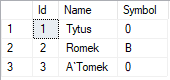

# SQL Row Versioning

<!-- Id: sql-optimistic-02  -->
<!-- Categories: SQL -->
<!-- Date: 20200728  -->

<!-- #header -->
<!-- #endheader -->


```sql
drop database if EXISTS [FunkyCode.RowVersion]

create database [FunkyCode.RowVersion]

drop table if EXISTS dbo.Users
GO

create table dbo.Users
(
  Id   INT identity (1,1) primary key,
  Name VARCHAR(30),
  Symbol NVARCHAR(1)
);
GO

insert into dbo.Users values 
('Tytus', '0'),
('Romek', '0'),
('A`Tomek', '0')
GO

select * from dbo.Users 
```

 


<table><tr><th> A </th><th> B </th></tr><tr><td valign='top'>

```sql
-- (1)
set transaction isolation level READ COMMITTED
begin transaction A 

-- (4)
update dbo.Users set Symbol = 'A' where Id = 2

-- (6)
commit transaction
```
</td><td valign='top'>

```sql
-- (2)
set transaction isolation level Read COMMITTED
begin transaction B

-- (3)
select * from dbo.Users where Id in (1,2)

-- (5)
select * from dbo.Users where Id = 2 
-- watch different behaviour !!!

-- (7)
select * from dbo.Users where Id in (1,2)

-- (8)
commit transaction 
```

</td></tr></table>

Then let's enable Read Commited Snapshot Isolation (RCSI):

## Read Committed Snapshot Isolation (RCSI)

Let's perform transactions steps like indicated in comments. Notice that (5) will stop and wait till (6) is commited (or rollbacked).

```sql
ALTER DATABASE [FunkyCode.RowVersion] SET READ_COMMITTED_SNAPSHOT ON;
```

I noticed that query above normally ocassionally stuck without response. Normally it takes 1 second to complete. What helps is to restart SQL Server instance.

Below query let me check status of snapshot isolation.

```sql
SELECT DB_NAME(database_id), 
    is_read_committed_snapshot_on,
    snapshot_isolation_state_desc 
FROM sys.databases
WHERE database_id = DB_ID();
```

Let's perform transaction steps again. This time (5) didn't wait for (6). 

## Snapshot Isolation

Let's enable *Snapshot isolation* executing these commands:

```sql
ALTER DATABASE [FunkyCode.RowVersion] SET READ_COMMITTED_SNAPSHOT OFF;
ALTER DATABASE [FunkyCode.RowVersion] SET ALLOW_SNAPSHOT_ISOLATION ON;
```

<table><tr><th> A </th><th> B </th></tr><tr><td valign='top'>

```sql
-- (1)
set transaction isolation level SNAPSHOT
begin transaction A 

-- (3)
update dbo.Users set Symbol = 'A' where Id = 2

-- (5)
commit transaction
```

</td><td valign='top'>

```sql
-- (2)
set transaction isolation level SNAPSHOT
begin transaction B

-- (4)
update dbo.Users set Symbol = 'B' where Id = 2
-- will wait for Transaction A if it will be committed or rollbacked

-- (6)
commit transaction
```

</td></tr></table>

After (5) is executed you observe message:

```script
Msg 3960, Level 16, State 3, Line 8
Snapshot isolation transaction aborted due to update conflict. You cannot use snapshot isolation to access table 'dbo.Users' directly or indirectly in database 'FunkyCode.RowVersion' to update, delete, or insert the row that has been modified or deleted by another transaction. Retry the transaction or change the isolation level for the update/delete statement.
```

It was because both queries tried to update the same row. 

If you execute steps in a little different order: 1-2-4-3-6-5 you notice that it's not important which transaction started first. It's important which transaction perform write operation.

Such conflicts are possible only with SI (not RCSI), so we need to be aware and prepared for them. Application must be written in a way that update conflicts are foreseen

Now, let's analyse example above with one difference: *rollback* instead of *commit* in (5) step. 

<table><tr><th> A </th><th> B </th></tr><tr><td valign='top'>

```sql
-- (1)
set transaction isolation level SNAPSHOT
begin transaction A 

-- (3)
update dbo.Users set Symbol = 'A' where Id = 2

-- (5)
rollback transaction
```

</td><td valign='top'>

```sql
-- (2)
set transaction isolation level SNAPSHOT
begin transaction B

-- (4)
update dbo.Users set Symbol = 'B' where Id = 2
-- will wait for Transaction A if it will be committed or rollbacked

-- (6)
commit transaction
```

</td></tr></table>

In this case as Transaction A hadn't changed row version in table, there's freedom for Transaction B to update table. So there's 'B' symbol inside Users table.




#### References

[https://sqlperformance.com/2014/05/t-sql-queries/read-committed-snapshot-isolation](https://sqlperformance.com/2014/05/t-sql-queries/read-committed-snapshot-isolation)


### Summary

Somehow to summary.

<table><tr><th> A </th><th> B </th></tr><tr><td valign='top'>

```sql

```

</td><td valign='top'>

```sql

```

</td></tr></table>