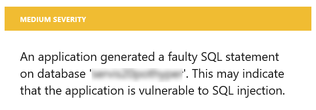
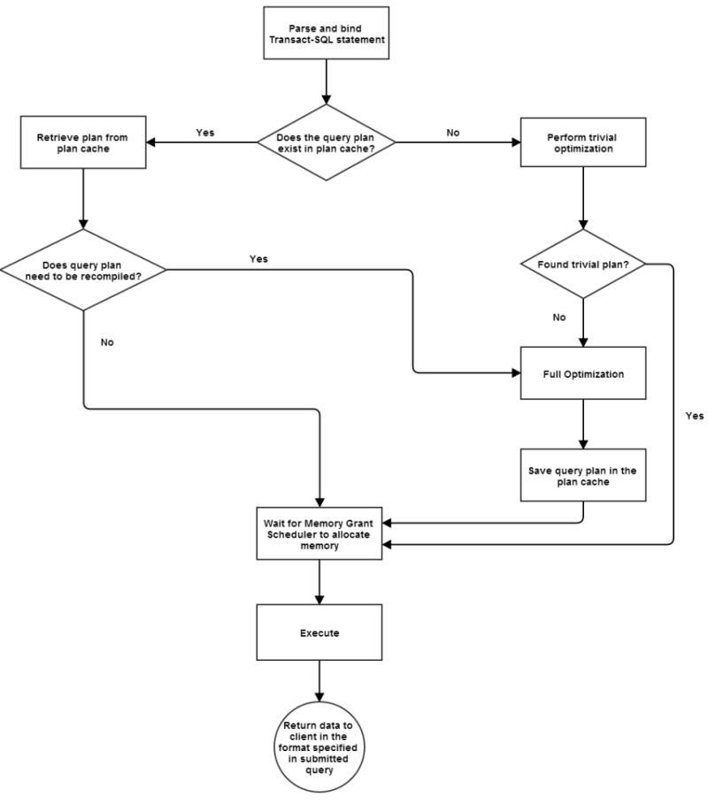
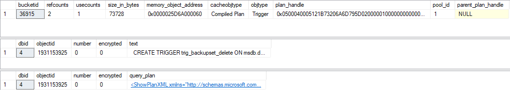
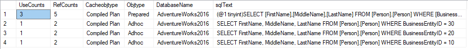
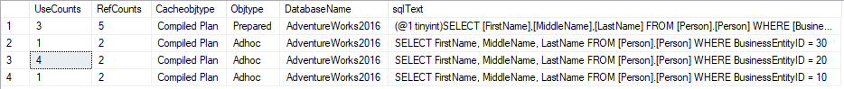
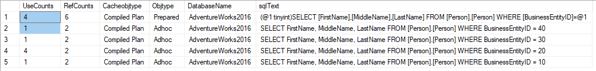
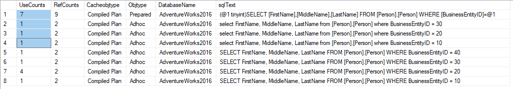
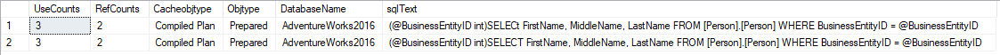
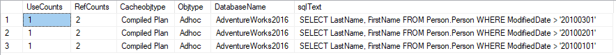

# Why query parametrization matters ?

<style>

.funky-example {
 counter-reset: steps;
 border-left: 5px solid lightgray;
    margin-left: 5px;
    padding-left: 20px;
}

.funky-example ol {
  list-style: none;
 
}

.funky-example ol li {
  counter-increment: steps;
}

.funky-example ol li::before {
  content: counter(steps);
  margin-right: 0.5rem;
  background: lightgray;
  color: white;
  width: 1.2em;
  height: 1.2em;
  border-radius: 50%;
  display: inline-grid;
  place-items: center;
  line-height: 1.2em;
}
.funky-example ol ol li::before {
  background: darkorchid;
}


.funky-example h3 {
    color: darkgray;
}
</style>


<!-- Id: sql-why-query-parametrization-matters -->
<!-- Categories: SQL, Performance -->
<!-- Date: 20200403 -->

<!-- #header -->
Vulnerability for SQL injection is quite common knowledge about dynamic SQL and good practice is to replace dynamic SQL statemets with parametrized SQL statements. But there is also another big advantage almost as important as first mentioned. It's about permance.  
<!-- #endheader -->

I developed Data Access Layer application talking with Azure Sql Database. Having no much time I quickly applied dynamic SQL statement instead of parametrized one. Quickly after deployment on stage environment I received message from Azure (<<azure>>):



### What's faulty SQL ?

In this case it means dynamic (literal) SQL (<<dynamic>>)

```sql:dynamic
EXEC('SELECT FirstName, MiddleName, LastName FROM [Person].[Person] WHERE BusinessEntityID = 10')
```

Application could be vurnelable to SQL injection because when SQL statements are constructed by string concatenation in listing id (<<dynamic-2>>)can be `'10'` but can be also `'10; delete from [Person].[Person]'`

```sql:dynamic-2
SELECT * FROM [Person].[Person] WHERE BusinessEntityID = ' + id
```

To make Azure happy I should rather use parametrized SQL (<<parametrized>>).

```sql:parametrized
exec sp_executesql 'SELECT FirstName, MiddleName, LastName FROM [Person].[Person] WHERE BusinessEntityID = @BusinessEntityID', '@BusinessEntityID int', @BusinessEntityID=10
```

### What's true but ...

There's no information about performance issues which dynamic SQL could cause. This is what I would like to investigate deeper in this article. 
Dynamic queries forces SQL Server to be constructed and compiled every time whereas for parametrized queries it generates a query execution plan just once. When SQL Server encounter the same SQL parametrized statement it will take execution plan form the cache which will contribute to better performance.



### Inside Query Plans

To take a look at query plan information we can use following features (<<dm-for-plans>>):

- sys.dm_exec_cached_plans 
- sys.dm_exec_sql_text  
- sys.dm_exec_query_plan 
- sys.dm_exec_plan_attributes

```sql:dm-for-plans
-- sys.dm_exec_cached_plans is dynamic management view
SELECT top 1 * FROM sys.dm_exec_cached_plans

-- whereas sys.dm_exec_sql_text and sys.dm_exec_query_plan
DECLARE @plan_handle varbinary(max) = (SELECT TOP 1 plan_handle FROM sys.dm_exec_cached_plans)
SELECT * FROM sys.dm_exec_sql_text(@plan_handle) 
SELECT * FROM sys.dm_exec_query_plan(@plan_handle)
-- SELECT * FROM sys.dm_exec_plan_attributes(@plan_handle)
```



We can as well combine this items to have all in one once forever (<<dm-plan-combined>>).

```sql:dm-plan-combined
SELECT UseCounts, RefCounts, Cacheobjtype, Objtype, ISNULL(DB_NAME(T.dbid),'ResourceDB') AS DatabaseName, TEXT AS sqlText, query_plan 
FROM sys.dm_exec_cached_plans 
CROSS APPLY sys.dm_exec_sql_text(plan_handle) T
CROSS APPLY sys.dm_exec_query_plan(plan_handle) P
WHERE T.dbid = DB_ID()
ORDER BY T.dbid,UseCounts DESC
``` 

https://docs.microsoft.com/en-us/sql/relational-databases/system-dynamic-management-views/sys-dm-exec-cached-plans-transact-sql?view=sql-server-ver15

Clearing cache should be performed by database admin and permissions for such operations should very careffully admited, especially 

```sql
-- This command removes all cached plans from memory
DBCC FREEPROCCACHE

-- This command allows you to specify a particular database id, and then clears all plans from that particular database. 
DBCC FLUSHPROCINDB (<dbid>)
```

Statement below should be used between every excercise.

```sql
-- DBCC FLUSHPROCINDB (DB_ID('AdventureWorks2016')) doesn't work !
DECLARE @dbid smallint = (SELECT DB_ID('AdventureWorks2016'))
DBCC FLUSHPROCINDB (@dbid)
```

And here's little modified query to display only what we need.

```sql
SELECT UseCounts, RefCounts, Cacheobjtype, Objtype, ISNULL(DB_NAME(T.dbid),'ResourceDB') AS DatabaseName, TEXT AS sqlText
FROM sys.dm_exec_cached_plans 
CROSS APPLY sys.dm_exec_sql_text(plan_handle) T
WHERE T.dbid = DB_ID() and TEXT not like '%dm_exec_cached_plans%'
ORDER BY T.dbid, UseCounts DESC
```

### Statements 

<div class='funky-example'>

### Example 1

1. Let's launch SQL queries below one by another.


```sql
-- (1) statement one by one
SELECT FirstName, MiddleName, LastName FROM [Person].[Person] WHERE BusinessEntityID = 10
SELECT FirstName, MiddleName, LastName FROM [Person].[Person] WHERE BusinessEntityID = 20
SELECT FirstName, MiddleName, LastName FROM [Person].[Person] WHERE BusinessEntityID = 30
```


2. Excute query 3 times


```sql
-- execute this query x3
SELECT FirstName, MiddleName, LastName FROM [Person].[Person] WHERE BusinessEntityID = 20
```



3. Execute query with new `BusinessEntityID` 

```sql
SELECT FirstName, MiddleName, LastName FROM [Person].[Person] WHERE BusinessEntityID = 40
```



It seems like both *Prepared* and *Adhoc* plans were used.

When values are specified explicitely SQL Server uses feature called `simple paramerization`. With simple parametrization SQL creates two execution plans. The first execution plan is shell plan containing a pointer to the second one. Unfortunatelly, it only applies to a small group of queries.

4. Last query is the same but i changed uppercased statements into lowercased.

```sql
select FirstName, MiddleName, LastName from [Person].[Person] where BusinessEntityID = 10
select FirstName, MiddleName, LastName from [Person].[Person] where BusinessEntityID = 20
select FirstName, MiddleName, LastName from [Person].[Person] where BusinessEntityID = 30
```



Optimizer is treating this queries as different queries but at least it takes advantage of *Prepared* query.

</div>


### Quering other way

I observed the same SQL Server behaviour and results when using the same statements in shape as on listing.

```sql
EXEC('SELECT FirstName, MiddleName, LastName FROM [Person].[Person] WHERE BusinessEntityID = 10'
EXEC sp_executesql N'SELECT FirstName, MiddleName, LastName FROM [Person].[Person] WHERE BusinessEntityID = 10'
``` 

### Parametrized queries

Now let's move to parametrized queries.

```sql
-- (4) sp_executesql with parameters
declare @parametrizedSql nvarchar(max) = 'SELECT FirstName, MiddleName, LastName FROM [Person].[Person] WHERE BusinessEntityID = @BusinessEntityID'
declare @parameterDefinition nvarchar(max) = '@BusinessEntityID int'
exec sp_executesql @parametrizedSql, @parameterDefinition, @BusinessEntityID=10
exec sp_executesql @parametrizedSql, @parameterDefinition, @BusinessEntityID=20
exec sp_executesql @parametrizedSql, @parameterDefinition, @BusinessEntityID=30
```

See that there's only one execution plan that was created for this query.


Let's make small change in query and in @parametrizedSql rename 'SELECT' to 'SELECt' 
```sql
declare @parametrizedSql nvarchar(max) = 'SELECt FirstName, MiddleName, LastName FROM [Person].[Person] WHERE BusinessEntityID = @BusinessEntityID'
```
and launch again queries one by another. Now, because of this tiny typo which shouldn't affect our query at all we have two execution plans:



SQL Server uses hash value as representation for every query. When query is run, SQL Server calculates hash and checks if there's such hash in cache. The hash value for the query plan is generated directly from the text. If there is even a tiny change in the query text a new hash value will be generated and there will be no match with existing hash values. 


### Simple parametrization limitation 

We observed that there's `simple parametrization` mechanism which creates parametrized query plan for dynamic SQL statements. However I learned that usage of this feature is somehow limited to very simple queries.

Let's examine very similar queries and launch them one by another.

```sql
SELECT LastName, FirstName FROM Person.Person WHERE ModifiedDate > '20100101'
SELECT LastName, FirstName FROM Person.Person WHERE ModifiedDate > '20100201'
SELECT LastName, FirstName FROM Person.Person WHERE ModifiedDate > '20100301'
```

In this case there's nothing like *Prepared* query plan. That means that `simple parametrization` didn't work.



For comparison launch queries below one by another.

```sql
EXEC sp_executesql N'SELECT LastName, FirstName FROM Person.Person WHERE ModifiedDate > @date', N'@date datetime', @date='20100101'
EXEC sp_executesql N'SELECT LastName, FirstName FROM Person.Person WHERE ModifiedDate > @date', N'@date datetime', @date='20100201'
EXEC sp_executesql N'SELECT LastName, FirstName FROM Person.Person WHERE ModifiedDate > @date', N'@date datetime', @date='20100301'
```


So far I gathered knowledge about difference between dynamic and parametrized queries and how it is related to query plans and plan caches. Now I am going to make some performance tests in order to check how these two kinds of queries affect performance. As a base for my tests I will use query from 

```sql:test-statement:SQL statement used in tests
SELECT COUNT(TransactionId)  FROM  [Production].[TransactionHistory] H
JOIN Production.Product P ON P.ProductID = H.ProductID
JOIN Production.ProductModel M On M.ProductModelID = P.ProductModelID
WHERE H.TransactionDate > '20140101' AND M.Name LIKE 'B%'
```

```csharp:service-dynamic-ver:Dynamic version
public class DynamicSqlService : IService
{
    public int ExecuteTest(List<Tuple<DateTime, string>> dateTimes)
    {
        var rowCounts = new ConcurrentBag<int>();

        Parallel.ForEach(dateTimes, (dt) =>
        {
            var dateStr = $"{dt.Item1.Year}{dt.Item1.Month:00}{dt.Item1.Day:00}";

            var sql = @$"SELECT count(TransactionId)  FROM  [Production].[TransactionHistory] H
                         JOIN Production.Product P ON P.ProductID = H.ProductID
                         JOIN Production.ProductModel M ON M.ProductModelID = P.ProductModelID
                         WHERE H.TransactionDate > '{dateStr}' AND M.Name LIKE '{dt.Item2}%'";

            using var conn = new SqlConnection(Consts.ConnectionString);
            conn.Open();

            using var cmd = new SqlCommand(sql, conn) { CommandType = CommandType.Text };

            var rowCount = (int)cmd.ExecuteScalar();
            rowCounts.Add(rowCount);
        });

        var sum = rowCounts.Sum();
        return sum;
    }
}
```

```csharp:service-param-ver:Parametrized version
public class ParametrizedSqlService : IService
{
    public int ExecuteTest(List<Tuple<DateTime, string>> dateTimes)
    {
        var rowCounts = new ConcurrentBag<int>();

        var sql = @$"SELECT count(TransactionId) FROM [Production].[TransactionHistory] H
                     JOIN Production.Product P ON P.ProductID = H.ProductID
                     JOIN Production.ProductModel M ON M.ProductModelID = P.ProductModelID
                     WHERE H.TransactionDate > @date AND M.Name LIKE @letter";

        Parallel.ForEach(dateTimes, (dt) =>
        {
            using var conn = new SqlConnection(Consts.ConnectionString);
            conn.Open();

            using var cmd = new SqlCommand(sql, conn) { CommandType = CommandType.Text };
            cmd.Parameters.Add(new SqlParameter("@date", dt.Item1));
            cmd.Parameters.Add(new SqlParameter("@letter", $"{dt.Item2}%"));

            var rowCount = (int)cmd.ExecuteScalar();
            rowCounts.Add(rowCount);
        });

        var sum = rowCounts.Sum();
        return sum;
    }
}
```


```cmd
Execute test for DynamicSqlService
Drop and restore database, then [Enter]

Start...
Stop.
Count=17106417
Elapsed=79252

Execute test for ParametrizedSqlService
Drop and restore database, then [Enter]

Start...
Stop.
Count=17106417
Elapsed=46823
```