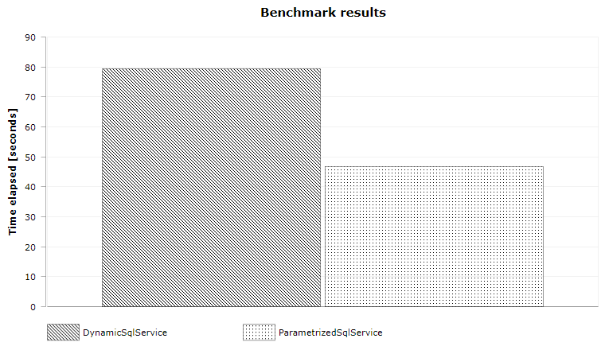

# Why query parametrization matters ?

<!-- Id: sql-why-query-parametrization-matters -->
<!-- Categories: SQL, Performance -->
<!-- Date: 20200403 -->
<!-- Meta: HasCaptions -->

<!-- #header -->
Vulnerability for SQL injection is quite common knowledge about dynamic SQL and good practice is to replace dynamic SQL statemets with parametrized SQL statements. But there is also another big advantage almost as important as first mentioned. It's about permance.  
<!-- #endheader -->

## Introduction

I developed Data Access Layer application talking with Azure Sql Database. Having no much time I quickly applied dynamic SQL statement instead of parametrized one. Quickly after deployment on stage environment I received message from Azure (<<azure>>):


**What's faulty SQL?** In this case it means dynamic (literal) SQL (<<dynamic>>)

```sql:dynamic
EXEC('SELECT FirstName, MiddleName, LastName FROM [Person].[Person] WHERE BusinessEntityID = 10')
```

Application could be vurnelable to SQL injection because when SQL statements are constructed by string concatenation in <<dynamic-2>> `id` can be `'10'` but can be also `'10; delete from [Person].[Person]'`

```sql:dynamic-2
SELECT * FROM [Person].[Person] WHERE BusinessEntityID = ' + id
```

To make Azure happy I should rather use parametrized SQL (<<parametrized>>).

```sql:parametrized
exec sp_executesql 'SELECT FirstName, MiddleName, LastName FROM [Person].[Person] WHERE BusinessEntityID = @BusinessEntityID', '@BusinessEntityID int', @BusinessEntityID=10
```

**That's true but...** there's no information about performance issues which dynamic SQL could cause. This is what I would like to investigate deeper in this article. 
Dynamic queries forces SQL Server to be constructed and compiled every time whereas for parametrized queries it generates a query execution plan just once. When SQL Server encounter the same SQL parametrized statement it will take execution plan form the cache which will contribute to better performance.

## Query plan and plan cache recap

Before query is executed SQL Server need to create *execution plan* than is step-by-step instruction how to finally bring queried data to client and how to do it most efficiently. For example for `JOIN` statement there's three join algorithms and SQL Server must decide which one should be use. Other example: should SEEK or rather SCAN operation should be applied? Lot of things happen in `Full Optimization` stage (<<sql-query-scheme>>) when query plan is created. 


We do not want to wait to long for query plan creation all the more we also need to wait for query plan execution. That's why once SQL Server creates query plan it saves query plan in plan cache in order to reuse it for identical and also for similar queries. Here's the main point of this article: 

> When queries are not parametrized SQL Server treats every query as different query even if they schemas are identical and there's only difference in parameters values.

SQL Server uses hash value as representation for every query. When query is run, SQL Server calculates hash and checks if there's such hash in cache. The hash value for the query plan is generated directly from the text. If there is even a tiny change in the query text a new hash value will be generated and there will be no match with existing hash values. 

## Quick look at SQL Server tools for plan cache

To take a look at query plan information we can use following features (<<dm-for-plans>>):

- sys.dm_exec_cached_plans 
- sys.dm_exec_sql_text  
- sys.dm_exec_query_plan 
- sys.dm_exec_plan_attributes

```sql:dm-for-plans+
-- sys.dm_exec_cached_plans is dynamic management view
SELECT top 1 * FROM sys.dm_exec_cached_plans

-- whereas sys.dm_exec_sql_text and sys.dm_exec_query_plan
DECLARE @plan_handle varbinary(max) = (SELECT TOP 1 plan_handle FROM sys.dm_exec_cached_plans)
SELECT * FROM sys.dm_exec_sql_text(@plan_handle) 
SELECT * FROM sys.dm_exec_query_plan(@plan_handle)
-- SELECT * FROM sys.dm_exec_plan_attributes(@plan_handle)
```


We can as well combine this items to have all in one once forever (<<dm-plan-combined>>).

```sql:dm-plan-combined
SELECT UseCounts, RefCounts, Cacheobjtype, Objtype, ISNULL(DB_NAME(T.dbid),'ResourceDB') AS DatabaseName, TEXT AS sqlText, query_plan 
FROM sys.dm_exec_cached_plans 
CROSS APPLY sys.dm_exec_sql_text(plan_handle) T
CROSS APPLY sys.dm_exec_query_plan(plan_handle) P
WHERE T.dbid = DB_ID()
ORDER BY T.dbid,UseCounts DESC
``` 

Explanation are in [MSDN documentation](
https://docs.microsoft.com/en-us/sql/relational-databases/system-dynamic-management-views/sys-dm-exec-cached-plans-transact-sql?view=sql-server-ver15).

Clearing cache should be performed by database admin and permissions for such operations should very careffully admited. In examples I would rather use statement from <<flushprocindb>> rather that from <<freeproccache>>.

```sql:freeproccache
-- This command removes all cached plans from memory
DBCC FREEPROCCACHE
```

```sql:flushprocindb
-- This command allows you to specify a particular database id, and then clears all plans from that particular database. 
DBCC FLUSHPROCINDB (<dbid>)
```

Statement from <<flush-adventureworks2016>> should be used between every excercise.

```sql:flush-adventureworks2016
-- DBCC FLUSHPROCINDB (DB_ID('AdventureWorks2016')) doesn't work !
DECLARE @dbid smallint = (SELECT DB_ID('AdventureWorks2016'))
DBCC FLUSHPROCINDB (@dbid)
```

And here's little modified query to display only what we need.

```sql
SELECT UseCounts, RefCounts, Cacheobjtype, Objtype, ISNULL(DB_NAME(T.dbid),'ResourceDB') AS DatabaseName, TEXT AS sqlText
FROM sys.dm_exec_cached_plans 
CROSS APPLY sys.dm_exec_sql_text(plan_handle) T
WHERE T.dbid = DB_ID() and TEXT not like '%dm_exec_cached_plans%'
ORDER BY T.dbid, UseCounts DESC
```

## Examples

<div class='funky-example'>

### Example 1: Dynamic queries


1. Let's launch SQL queries below one by another.

```sql:+
-- (1) statement one by one
SELECT FirstName, MiddleName, LastName FROM [Person].[Person] WHERE BusinessEntityID = 10
SELECT FirstName, MiddleName, LastName FROM [Person].[Person] WHERE BusinessEntityID = 20
SELECT FirstName, MiddleName, LastName FROM [Person].[Person] WHERE BusinessEntityID = 30
```


2. Execute query from <<three-times-query>> 3 times

```sql:three-times-query+
-- execute this query x3
SELECT FirstName, MiddleName, LastName FROM [Person].[Person] WHERE BusinessEntityID = 20
```


`UseCounts` has been incremented by every query.

3. Execute query with new `BusinessEntityID` 

```sql:+
SELECT FirstName, MiddleName, LastName FROM [Person].[Person] WHERE BusinessEntityID = 40
```


New *Adhoc* plan was created (Line 2) and also for *Prepared* plan (Line 1) `UseCounts` value has been incremented.

When values are specified explicitely SQL Server uses feature called `simple paramerization`. With simple parametrization SQL creates two execution plans. The first execution plan is shell plan containing a pointer to the second one. Unfortunatelly, it only applies to a small group of queries.

4. Let's examine very similar queries and launch them one by another.

```sql:sql-simple-param-failed+
SELECT LastName, FirstName FROM Person.Person WHERE ModifiedDate > '20100101'
SELECT LastName, FirstName FROM Person.Person WHERE ModifiedDate > '20100201'
SELECT LastName, FirstName FROM Person.Person WHERE ModifiedDate > '20100301'
```


In this case there's nothing like *Prepared* query plan. That means that `simple parametrization` didn't work.

5. Last query is the same but i changed uppercased statements into lowercased.

```sql:+
select FirstName, MiddleName, LastName from [Person].[Person] where BusinessEntityID = 10
select FirstName, MiddleName, LastName from [Person].[Person] where BusinessEntityID = 20
select FirstName, MiddleName, LastName from [Person].[Person] where BusinessEntityID = 30
```


Optimizer is treating this queries as different queries but at least it takes advantage of *Prepared* query.

</div>

<div class='funky-example'>

### Example 2: Parametrized queries

1. Now let's move to parametrized queries.

```sql:+
-- (4) sp_executesql with parameters
declare @parametrizedSql nvarchar(max) = 'SELECT FirstName, MiddleName, LastName FROM [Person].[Person] WHERE BusinessEntityID = @BusinessEntityID'
declare @parameterDefinition nvarchar(max) = '@BusinessEntityID int'
exec sp_executesql @parametrizedSql, @parameterDefinition, @BusinessEntityID=10
exec sp_executesql @parametrizedSql, @parameterDefinition, @BusinessEntityID=20
exec sp_executesql @parametrizedSql, @parameterDefinition, @BusinessEntityID=30
```


See that there's only one execution plan that was created for this query.

2. But let's make small change in query and in @parametrizedSql rename 'SELECT' to 'SELECt' 
```sql
declare @parametrizedSql nvarchar(max) = 'SELECt FirstName, MiddleName, LastName FROM [Person].[Person] WHERE BusinessEntityID = @BusinessEntityID'
```
and launch again queries one by another. Now, because of this tiny typo which shouldn't affect our query at all we have two execution plans:


We observed that there's `simple parametrization` mechanism which creates parametrized query plan for dynamic SQL statements. However I learned that usage of this feature is somehow limited to very simple queries.

4. Let's get back to query from <<sql-simple-param-failed>> and recreate them but in parametrized way.

```sql:+
EXEC sp_executesql N'SELECT LastName, FirstName FROM Person.Person WHERE ModifiedDate > @date', N'@date datetime', @date='20100101'
EXEC sp_executesql N'SELECT LastName, FirstName FROM Person.Person WHERE ModifiedDate > @date', N'@date datetime', @date='20100201'
EXEC sp_executesql N'SELECT LastName, FirstName FROM Person.Person WHERE ModifiedDate > @date', N'@date datetime', @date='20100301'
```


This time we again have single query plan for all queries.

</div>

## Benchmarks

So far I gathered knowledge about difference between dynamic and parametrized queries and how it is related to query plans and plan caches. Now I am going to make some performance tests in order to check how these two kinds of queries affect performance. As a base for my tests I will use query from <<test-statement>> which will take data from `AdventureWorks2016` database.

```sql:test-statement:SQL statement used in tests
SELECT COUNT(TransactionId)  FROM  [Production].[TransactionHistory] H
JOIN Production.Product P ON P.ProductID = H.ProductID
JOIN Production.ProductModel M On M.ProductModelID = P.ProductModelID
WHERE H.TransactionDate > '20140101' AND M.Name LIKE 'B%'
```

Full codebase is available on Funky Code GitHub repository.


[FunkyCode.SqlParametrization](https://github.com/funkycodeblog/FunkyCode.SqlParametrization)

Every query will be executed 10000 times with different values for `TransactionHistory.TransactionDate` and `Production.ProductModel.Name`. Full logic will be hidden behind IService (<<IService>>) which will receive list of 10000 `Tuple<DateTime, string>` items. Service will return sum of rows which were collected. 

```csharp:IService
public interface IService
{
    int ExecuteTest(List<Tuple<DateTime, string>> dateTimes);
}
```

I have two implementation of this interface: `DynamicSqlService` (<<service-dynamic-ver>>) 

```csharp:service-dynamic-ver:Dynamic version
public class DynamicSqlService : IService
{
    public int ExecuteTest(List<Tuple<DateTime, string>> dateTimes)
    {
        var rowCounts = new ConcurrentBag<int>();

        Parallel.ForEach(dateTimes, (dt) =>
        {
            var dateStr = $"{dt.Item1.Year}{dt.Item1.Month:00}{dt.Item1.Day:00}";

            var sql = @$"SELECT count(TransactionId)  FROM  [Production].[TransactionHistory] H
                         JOIN Production.Product P ON P.ProductID = H.ProductID
                         JOIN Production.ProductModel M ON M.ProductModelID = P.ProductModelID
                         WHERE H.TransactionDate > '{dateStr}' AND M.Name LIKE '{dt.Item2}%'";

            using var conn = new SqlConnection(Consts.ConnectionString);
            conn.Open();

            using var cmd = new SqlCommand(sql, conn) { CommandType = CommandType.Text };

            var rowCount = (int)cmd.ExecuteScalar();
            rowCounts.Add(rowCount);
        });

        var sum = rowCounts.Sum();
        return sum;
    }
}
```

and `ParametrizedSqlService` (<<service-param-ver>>) for comparison.

```csharp:service-param-ver:Parametrized version
public class ParametrizedSqlService : IService
{
    public int ExecuteTest(List<Tuple<DateTime, string>> dateTimes)
    {
        var rowCounts = new ConcurrentBag<int>();

        var sql = @$"SELECT count(TransactionId) FROM [Production].[TransactionHistory] H
                     JOIN Production.Product P ON P.ProductID = H.ProductID
                     JOIN Production.ProductModel M ON M.ProductModelID = P.ProductModelID
                     WHERE H.TransactionDate > @date AND M.Name LIKE @letter";

        Parallel.ForEach(dateTimes, (dt) =>
        {
            using var conn = new SqlConnection(Consts.ConnectionString);
            conn.Open();

            using var cmd = new SqlCommand(sql, conn) { CommandType = CommandType.Text };
            cmd.Parameters.Add(new SqlParameter("@date", dt.Item1));
            cmd.Parameters.Add(new SqlParameter("@letter", $"{dt.Item2}%"));

            var rowCount = (int)cmd.ExecuteScalar();
            rowCounts.Add(rowCount);
        });

        var sum = rowCounts.Sum();
        return sum;
    }
}
```

In this case, as I would like to restore database between `DynamicSqlService` and `ParametrizedSqlService` I am not using [BenchmarkDotNet](https://benchmarkdotnet.org/) but rather do measurements manually using simple `StopWatch` class hoping that this kind of tests is reliable. For drop and restoring I am using [SQL Database Reset](post/sql-database-reset).

<<benchmark-results>> and <<benchmark-results-graph>> contains results of my tests. 

```cmd:benchmark-results
Execute test for DynamicSqlService
Drop and restore database, then [Enter]

Start...
Stop.
Count=17106417
Elapsed=79252

Execute test for ParametrizedSqlService
Drop and restore database, then [Enter]

Start...
Stop.
Count=17106417
Elapsed=46823
```



As we see `ParametrizedSqlService` performs almost two times quicker than `DynamicSqlService`. It seems that some amount of time needs to be dedicated for creating 10000 query plans instead of creating it one time and keep it in cache.

