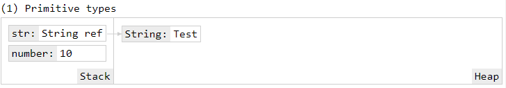
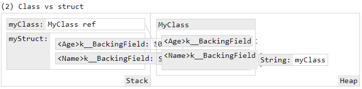
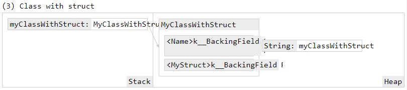
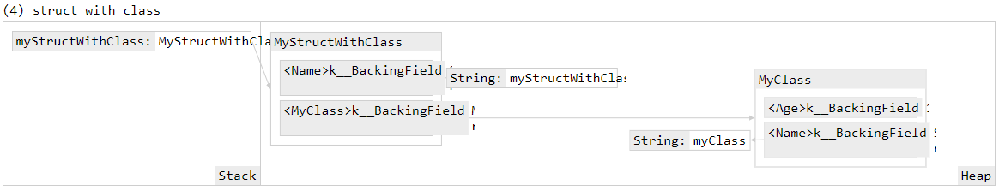
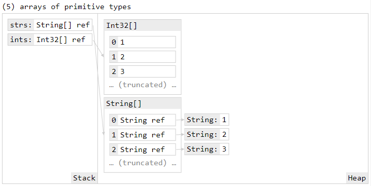
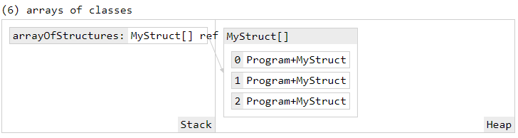
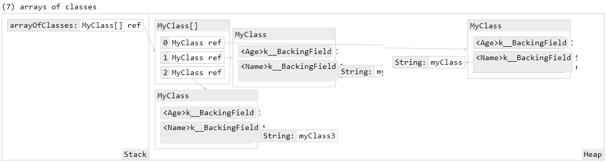
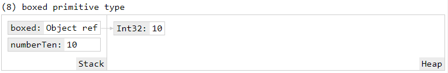

# Structure vs class revisited

<!-- Id: stack-vs-heap  -->
<!-- Categories: C#, Memory Management -->
<!-- Date: 20200421  -->

<!-- #header -->
<!-- #endheader -->


https://sharplab.io/


```csharp
struct MyStruct
{
    public int Age { get; set; }
    public string Name { get; set; }
}

class MyClass
{
    public int Age { get; set; }
    public string Name { get; set; }
}
```


```csharp
class MyClassWithStruct
{
    public string Name { get; set; }
    public MyStruct MyStruct { get; set; }
}

class MyStructWithClass
{
    public string Name { get; set; }
    public MyClass MyClass { get; set; }
}
```

```csharp
// (1) primitive types
Console.WriteLine("(1) Primitive types");

var number = 10;
var str = "Test";

// Inspect.MemoryGraph(str, number);
```




```csharp
// (2) class vs struct
Console.WriteLine("(2) Class vs struct");

var myStruct = new MyStruct
{
    Age = 10,
    Name = "myStruct"
};

var myClass = new MyClass
{
    Age = 10,
    Name = "myClass"
};

// Inspect.MemoryGraph(myStruct, myClass);

```


```csharp
// (3) class with struct
Console.WriteLine("(3) Class with struct");

var myClassWithStruct = new MyClassWithStruct
{
    Name = "myClassWithStruct",
    MyStruct = myStruct
};

// Inspect.MemoryGraph(myClassWithStruct);
```



```csharp
// (4) struct with class
Console.WriteLine("(4) struct with class");

var myStructWithClass = new MyStructWithClass
{
    Name = "myStructWithClass",
    MyClass = myClass
};

// Inspect.MemoryGraph(myStructWithClass);

```



```csharp
// (5) arrays of primitive types
Console.WriteLine("(5) arrays of primitive types");

var ints = new[] { 1, 2, 3, 4, 5 };
var strs = new[] { "1", "2", "3", "4", "5" };

// Inspect.MemoryGraph(ints, strs)
```



```csharp
// (6) arrays of struct
Console.WriteLine("(6) arrays of classes");

var myStruct2 = new MyStruct
{
    Age = 10,
    Name = "myStruct2"
};

var myStruct3 = new MyStruct
{
    Age = 10,
    Name = "myStruct3"
};

var arrayOfStructures = new[] { myStruct, myStruct2, myStruct3 };
// Inspect.MemoryGraph(arrayOfStructures);
```


```csharp
// (7) arrays of classes
Console.WriteLine("(7) arrays of classes");

var myClass2 = new MyClass
{
    Age = 10,
    Name = "myClass2"
};

var myClass3 = new MyClass
{
    Age = 10,
    Name = "myClass3"
};

var arrayOfClasses = new[] { myClass, myClass2, myClass3 };
// Inspect.MemoryGraph(arrayOfClasses);
```



```csharp
// (8) boxed primitive type
Console.WriteLine("(8) boxed primitive type");

var numberTen = 10;
object boxed = numberTen;
// Inspect.MemoryGraph(numberTen, boxed);
```

