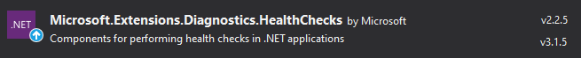
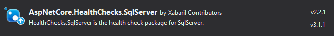
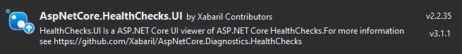
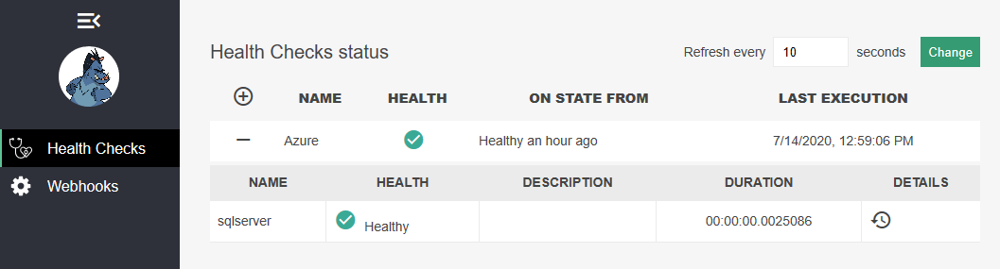

# Hello ASP.NET Core Health Checks

<!-- Id: aspnetcore-health-checks-01  -->
<!-- Categories: ASP.NET Core, Monitoring -->
<!-- Date: 20200713  -->

<!-- #header -->
After application successful deployment I am wondering if all live connections with external components. I may be ensured that my app is 100% ok thanks to unit tests passed. But how to check if in current moment database is working along with our app? And what about email server? Will it send us email whenever exception occurs? In general I would like to know if all connections to external services are in order. 
<!-- #endheader -->

This post is the part of series:
1. Hello ASP.NET Core Health Checks
2. [Custom ASP.NET Core Health Check](/post/aspnetcore-health-checks-02)

Before I discover `Health Checks` toolset I used to create something like hidden urls in my REST Api. I used to send GET requests which did some checks and send me raw response. That was quite ok but why not to use more sophisticated and professional tool that does this job even better.

#### Package installation

 Let's install three packages and configure it as simply as possible just to quickly have impression how library works and what benefits we can get.

1. Microsoft.Extensions.Diagnostics.HealthChecks



This is just engine for `Health Checks` feature. It gives us interfaces and helpers to create own checking plug-ins. For example we can create plugin for checking connection with SQL Server. But before we start developing any custom one it's good to check if maybe somebody already created what we need. For most typical cases there's already existing tool. List of available plugins are available [here](https://github.com/Xabaril/AspNetCore.Diagnostics.HealthChecks). 

2. AspNetCore.HealthChecks.SqlServer



Let's add package for SqlServer health check plugin which require only connection string as argument to check our connection.

3. AspNetCore.HealthChecks.UI



Two above described packages will do job, but their feedback will be generated as `json`  response. To have also graphics experience and see quickly if everything is in 'green' let's add also package that will render our results.

Having these packages installed only what we need is to add some configuration.

#### Configuration

In `ConfigureServices` method of `Startup.cs` there's in fact one line for every package:

```csharp
public IServiceProvider ConfigureServices(IServiceCollection services)
{
	// (...)
    
    var connStr = Configuration.GetConnectionString("defaultConnection");

	services
		.AddHealthChecks()
		.AddSqlServer(connStr);

	services.AddHealthChecksUI();
    
    // (...)
}
```
also in `Configure` method of `Startup.cs` there's not much to be done.

```csharp
public void Configure(IApplicationBuilder app, IHostingEnvironment env)
{
 	// (...)
    
	app.UseHealthChecks("/api/health", new HealthCheckOptions        {  
            Predicate = _ => true,
            ResponseWriter = UIResponseWriter.WriteHealthCheckUIResponse
        })
	   .UseHealthChecksUI(); 
    
	// (...)
}
```

Using `UseHealthChecksUI()` without any arguments configures default URL to `Health Checks` view which is `/healthchecks-ui`. There's possibility to override default URL and adjust to our application style, but I encountered some problems with that so I left it as it for a while.

Last step is to add some stuff to `appsettings.json` configuration file as this is required by UI package. For some reason absolute path is required so I needed created dedicated node in configuration for local machine and target environment.

```json
{
  "HealthChecksUI": {
    "HealthChecks": [
      {
        "Name": "Local",
        "Uri": "https://localhost:44364/api/health"
      }
    ]
  }
}
```

#### Results

So with a little effort we configured our `Health Checks` environment. After successful deployment finally I can check if connection to database is ok before any real request will be generated.

* Under [http://funkycode.pl/api/health](http://funkycode.pl/api/health) we obtain results in `json` file:

```json
{
  "status": "Healthy",
  "totalDuration": "00:00:00.0022727",
  "entries": {
    "sqlserver": {
      "data": {},
      "duration": "00:00:00.0022603",
      "status": "Healthy"
    }
  }
}
```
* ... and under [http://funkycode.pl/healthchecks-ui](http://funkycode.pl/healthchecks-ui) there is graphical representation of above data:



#### Summary

Quite quickly I managed to install and configure `Health Checks` to demonstrate usage and convince myself (and all readers) to invest at least some time for learning possibilities of this tool. `Health Checks` can be added quickly to all project and can be developed independently as it doesn't interfere with core application. 

In next post I will try to create custom plugin as I have real case where I can take advantage of existing engine and UI features for dedicated check.

