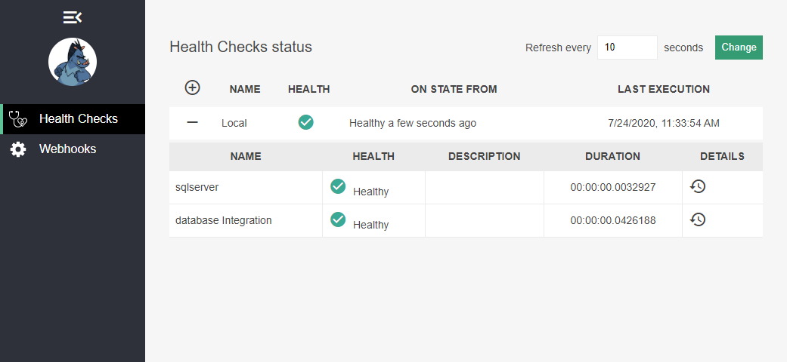
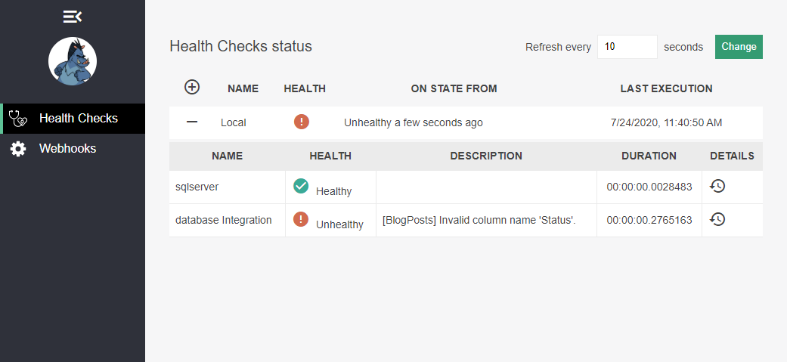

# Custom ASP.NET Core Health Check

<!-- Id: aspnetcore-health-checks-02  -->
<!-- Categories: ASP.NET Core, Monitoring -->
<!-- Date: 20200724  -->

<!-- #header -->
Once I took a part in project where backend component was developed along with database not exactly 100% in sync. Database model used to be scaffolded via Entity Framework Core Database First feature. However database team was forced to change tables during development creating discrepancies between app and db which typically I used to learn during development phase.
<!-- #endheader -->

This post is the part of series:
1. [Hello ASP.NET Core Health Checks](/post/aspnetcore-health-checks-01)
2. Custom ASP.NET Core Health Check

Therefore after application deployment on target environment I was wondering if all table models are in sync with database. Health check presented in this article can help having continuous control over integration between application and database, or rather between ORM framework and database as different frameworks can have their ways mapping database schema.

To implement custom health check it is just about implementing ```IHealthCheck``` interface which contains single method.

``` csharp
public class DbIntegrationHealthCheck : IHealthCheck
{
    public Task<HealthCheckResult> CheckHealthAsync(HealthCheckContext context, CancellationToken cancellationToken = new CancellationToke())
    {
        throw new NotImplementedException();
    }
}
```

Let's leave it for a while. I created separate class that include health check logic in order to easily move it to other projects and contexts. There's a little challenge to do it using reflection as ```FirstOrDefaultAsync()``` method is extension method no reflected when quering ```DbSet<T>```. So instead of relfecting class that contains this extensions I decided to make simple trick to execute ```FirstOrDefaultAsync()``` on every ```DbSet<T>```. If there's simplest way to do it, please let me know.

``` csharp
public static class EntityIntegrityTestTool
{
    public static async Task<List<HealthCheckItem>> Test(DbContext context)
    {
        var dbSetPropInfos = context.GetType()
            .GetProperties()
            .Where(p => p.PropertyType.IsGenericType &&
                        p.PropertyType.GetGenericTypeDefinition() == typeof(DbSet<>));

        var entityRepoType = typeof(TestExecutor<>);

        var result = new List<HealthCheckItem>();

        foreach (var dbSetPropInfo in dbSetPropInfos)
        {

                var genericArguments = dbSetPropInfo.PropertyType.GetGenericArguments();
                var testExecutorGenericType = entityRepoType.MakeGenericType(genericArguments);
                var testExecutor = (ITestExecutor)Activator.CreateInstance(testExecutorGenericType);
                var dbSet = dbSetPropInfo.GetValue(context);

                var healthCheckResult = await testExecutor.Test(dbSetPropInfo.Name, dbSet);

                result.Add(healthCheckResult);
        }

        return result;
    }

    private interface ITestExecutor
    {
        Task<HealthCheckItem> Test(string dbSetName, object dbSetRef) ;
    }

    private class TestExecutor<T> : ITestExecutor where T : class
    {
        public async Task<HealthCheckItem> Test(string dbSetName, object dbSetRef)
        {
            try
            {

                var set = (DbSet<T>)dbSetRef;
                var testItem = await set.FirstOrDefaultAsync();
                return HealthCheckItem.Ok(dbSetName);
            }
            catch (Exception e)
            {
                return HealthCheckItem.WithException(dbSetName, e);
            }
        }
    }
}
```

So only what I need is to have ```DbContext``` instance. As only place when I instantiate ```DbContext``` is ```BlogRepository``` I decided to extend ```IBlogRepository``` interface:

``` csharp
public interface IBlogRepository
{
    // (...)

    Task<List<HealthCheckItem>> PerformHealthCheck();
}
```

... and add health check logic there.

``` csharp
public class BlogRepository : IBlogRepository
{

    public BlogRepository(DbContextOptions<BlogContext> options)
    {
        _options = options;
    }

    // (...)

    public async Task<List<HealthCheckItem>> PerformHealthCheck()
    {
        using (var db = new BlogContext(_options))
        {
            var result = await EntityIntegrityTestTool.Test(db);
            return result;
        }
    }
}
```

In this case responsibility of ```DbIntegrationHealthCheck``` is to invoke health check method and process results.

``` csharp
public class DbIntegrationHealthCheck : IHealthCheck
{
    private readonly IBlogRepository _blogRepository;

    public DbIntegrationHealthCheck(IBlogRepository blogRepository)
    {
        _blogRepository = blogRepository;
    }

    public async Task<HealthCheckResult> CheckHealthAsync(HealthCheckContext context, CancellationToken cancellationToken = default)
    {
        var results = await _blogRepository.PerformHealthCheck();

        var isAnyError = results.Any(i => !i.IsOk);

        if (!isAnyError)
        {
            return HealthCheckResult.Healthy();
        }
        else
        {
            var unhealthyItems = results.Where(i => !i.IsOk).ToList();
            var description = string.Join(Environment.NewLine,
                unhealthyItems.Select(i => $"[{i.Name}] {i.Exception?.Message ?? .Description}"));

            return HealthCheckResult.Unhealthy(description);
        }
    }
}
```

Last thing is to add our custom health check to ```services``` in ```ConfigureServices``` in ```Startup``` class.

``` csharp
public IServiceProvider ConfigureServices(IServiceCollection services)
{
	// (...)

    var connStr = Configuration.GetConnectionString("defaultConnection");

    services
        .AddHealthChecks()
        .AddSqlServer(connStr)
        .AddCheck<DbIntegrationHealthCheck>("Database Integration");

    services.AddHealthChecksUI();

    // (...)
}
``` 

Of course I need to create tests for this feature, but as it is not topic of this article I will just perform quick manual test on copy of working databse. This is snippet for creating database copy via backup/restore commands:

```sql
declare @db nvarchar(max) = 'BlogEngine'
declare @path nvarchar(max) = 'C:\Temp';
declare @newDb nvarchar(max) = 'BlogEngine-01'
declare @isToDeleteBackup bit = 1

declare @now datetime = GetDate()
declare @id nvarchar(max) = FORMAT (@now, 'yyyyMMdd-hhmmss') 
declare @dbBackupPath nvarchar(max) = concat(@path, '\', @db, '-', @id, '.bak');
declare @newDbMdfPath nvarchar(max) = concat(@path, '\', @newDb, '.mdf');
declare @newDbLdfPath nvarchar(max) = concat(@path, '\', @newDb, '_log.ldf');
declare @dbLog nvarchar(max) = concat(@db, '_Log');

backup database @db to disk = @dbBackupPath 

restore database @newDb from disk = @dbBackupPath
   with move @db to @newDbMdfPath,   
   move @dbLog to @newDbLdfPath;  

if @isToDeleteBackup = 1
begin
	declare @cmd nvarchar(max) = concat ('xp_cmdshell ', quotename(concat('del ', @dbBackupPath),''''))
	print concat('Executing command:', @cmd)
	exec (@cmd)
end

GO
```

I have copy of database explicitly for this test purpose. Quick connection string update and then I can run appliaction. So far everything works as expected:



Now I will simulate possible action on behalf of my database collegaue.

```sql
alter table dbo.BlogPosts drop column [Status] 
```

Then after 10 seconds at the latest I observed that changes were reflected in Health Checks dashboard.




#### Summary

Although there are many [existing healtch checks](https://github.com/Xabaril/AspNetCore.Diagnostics.HealthChecks) there is high priority that due to specificity of any solution there will be necessity to create something explicitly tailored. Luckilly this is quite simple as health check framework suite takes care for processing custom items. 


#### References

[https://rmauro.dev/adding-health-checks-ui/](https://rmauro.dev/adding-health-checks-ui/)
