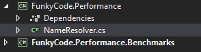
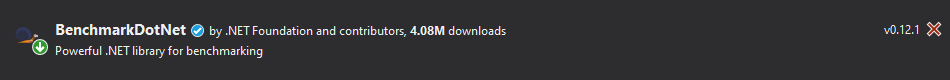
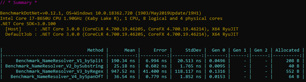

# Hello BenchmarkDotNet

<!-- Id: benchmark-dot-net  -->
<!-- Categories: Performance, BenchmarkDotNet -->
<!-- Date: 20200429  -->

<!-- #header -->
My recent projects didn't required me to thing much about performance and low latency processing. Having a little pain of conscience I dedicated one evening to take look at some articles and videos. I encountered _BenchmarkDotNet_ and decided to tinker a little bit with this tool.
<!-- #endheader -->

This article is inspired by [this](https://www.stevejgordon.co.uk/an-introduction-to-optimising-code-using-span-t) article. I read it and decided to play by myself. 
But I am going to add some _value added_ in my version.

##### Preparations

Let's consider simple requirement. Method to extract name from email. Just to say _Hello John_ when _john.doe@gmail.com_ writes to us. But we expect a lot of traffic so performance is critical in this scenario.
So interface first (without asynchronicity for simplicity case):

```csharp
public interface INameResolver
{
    string GetName(string email);
}
```

I do not know most optimal solution. What I can do is to write several implementation candidates and find the most suitable one. 

Let's start with somewhat typical implementations:

```csharp
public class NameResolver_V1_bySplit : INameResolver
{
    public string GetName(string email)
    {
        var items = email.Split('.');
        return items[0];
    }
}
```

```csharp
public class NameResolver_V2_bySubstring : INameResolver
{
    public string GetName(string email)
    {
        var dotIndex = email.IndexOf('.');
        var name = email.Substring(0, dotIndex);
        return name;
    }
}
```

Then a little bit _regex_:

```csharp
public class NameResolver_V3_byRegex : INameResolver
{
    public string GetName(string email)
    {
        var pattern = @"^(?<name>[A-Za-z0-9]+)[\.|@]";
        var match = Regex.Match(email, pattern);
        var name = match.Groups["name"].Value;
        return "";
    }
}
```

... and finally somethink most sophisticated: ```Span<T>``` C# 7.2 feature:

```csharp
public class NameResolver_V4_bySpanOfT : INameResolver
{
    public string GetName(string email)
    {
        var dotIndex = email.IndexOf('.');
        var emailAsSpan = email.AsSpan();
        var sliced = emailAsSpan.Slice(dotIndex + 1);
        return sliced.ToString();
    }
}
```

<br/>

##### BenchmarkDotNet step by step

Before implementation let's read about this framework [here](https://github.com/dotnet/BenchmarkDotNet) and [there](https://fransbouma.github.io/BenchmarkDotNet/).

1. I added new project dedicated for benchmark tests.



2. then I added ```BenchmarkDotNet``` NuGet package.



3. Way of benchmark tests creation is similar to unit test creation. Instead of ```[Test]``` or ```[Fact]``` attribute we use ```[Benchmark]``` attribute.

```csharp
[MemoryDiagnoser]
public class NameResolverBenchmarks
{
    private string _email = "maciej.szczudlo@pl.abb.com";

    [Benchmark]
    public void Benchmark_NameResolver_V1_bySplit()
    {
        var resolver = new NameResolver_V1_bySplit();
        var name = resolver.GetName(_email);
    }

    [Benchmark]
    public void Benchmark_NameResolver_V2_bySubstring()
    {
        var resolver = new NameResolver_V2_bySubstring();
        var name = resolver.GetName(_email);
    }

    [Benchmark]
    public void Benchmark_NameResolver_V3_byRegex()
    {
        var resolver = new NameResolver_V3_byRegex();
        var name = resolver.GetName(_email);
    }

    [Benchmark]
    public void Benchmark_NameResolver_V4_bySpanOfT()
    {
        var resolver = new NameResolver_V4_bySpanOfT();
        var name = resolver.GetName(_email);
    }
}
```

```[MemoryDiagnoser]``` atribute adds memory metrics to our tests.

4. But we need to launch Test Runner via code included in ```Main``` class.

```csharp
class Program
{
    static void Main(string[] args)
    {
        var summary = BenchmarkRunner.Run<NameResolverBenchmarks>();
    }
}
```

5. Switch to  configuration.

6. Launch _Benchmarks_ project via .

7. After launchig you'll see that lot of thinks happen on the console. Many calculatotions are being performed. 
Finally there is ```// * Summary *``` with results presented.



What I will take look at for now is ```Mean``` metrics. There some conclusions:

1. Two ```string``` methods which many times I used interchangeably: ```.Split``` and ```.Substring``` are so different when it comes to performance. Method with ```.Substring``` is about 7 times faster that method with ```.Split```.
2. _Regural expressions_ which I always respected and treated as most decent solution wherever possible proved to be extremely slow.
3. ```Span<T>``` feature designed for optimization, borrowed from this [article](https://www.stevejgordon.co.uk/an-introduction-to-optimising-code-using-span-t) proves to be slower than V2. In mentioned article there's very similar comparison, but there's no convertsion to string after using ```Span<T>```. 

<br />

I think I have openned Pandora's Box. Knowing how methods similar in size and responsibility can differ when it comes to performance. Even not being expert in performance topic now I can at least choose _less slow_ option. However there are some questions which occured after working with ```BenchmarkDotNet```:
1. How to integrate benchmark tests with unit tests? In case study from this article I do not checks if all methods produces the same results - only in that case tests have any sense. 
2. How to integrate benchmark tests with CI/CD process? Can we anyhow set maximum executing time for particular methods and test if they are not exceeded.

I hope I will be back with answers in articles to come. 


