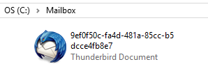
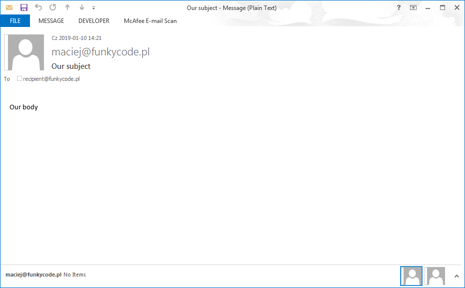
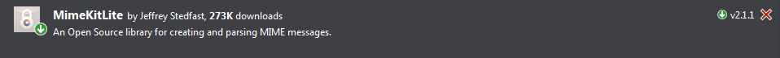

# Email integration testing

<!-- Id: neo4j-02  -->
<!-- Categories: Testing, neo4j  -->
<!-- Date: 20200319  -->

<!-- #header -->
Sending emails is I guess a quite common feature in business applications development, so there’s a common necessity to apply to send emails tests. In my opinion, apart from unit testing, it is good practice to validate if email as the end product of specific application behaviour was sent and if has proper recipients, subject or message.
<!-- #endheader -->

There is a couple of tools for email testing such as:
https://mailtrap.io/

With full respect to this tool, I prefer a simple yet powerful method to do this job.

``` csharp
var smtpClient = new SmtpClient
{
    DeliveryMethod = SmtpDeliveryMethod.SpecifiedPickupDirectory,
    PickupDirectoryLocation = @"C:\EmailBox"
};
 
var mailMessage = new MailMessage();
mailMessage.From = new MailAddress("maciej@funkycode.pl");
mailMessage.To.Add("recipient@funkycode.pl");
mailMessage.Subject = "Our subject";
mailMessage.Body = "Our body";

smtpClient.Send(mailMessage);
```



You can view this file in your default email client.



``` code
X-Sender: maciej@funkycode.pl
X-Receiver: recipient@funkycode.pl
MIME-Version: 1.0
From: maciej@funkycode.pl
To: recipient@funkycode.pl
Date: 23 Oct 2018 19:10:35 +0200
Subject: Our subject
Content-Type: text/plain; charset=us-ascii
Content-Transfer-Encoding: quoted-printable
 
Our body
```

You can parse this file manually, but maybe a better option is to use a dedicated tool, like this.

http://www.mimekit.net/



``` code
PM> Install-Package MimeKitLite
```
You can easily get email data from a file and validate it in integration tests.

``` csharp
var lastSavedFilePath = new DirectoryInfo(@"C:\EmailBox").GetFiles().OrderByDescending(f => f.LastWriteTime).FirstOrDefault()?.FullName;
var mimeMessage = MimeMessage.Load(lastSavedFilePath);

var mailto = mimeMessage.To;
var mailfrom = mimeMessage.From;
var mailcc = mimeMessage.Cc;
var mailsubject = mimeMessage.Subject;
var maildate = mimeMessage.Date;
var mailplainBody = mimeMessage.TextBody;
var mailhtmlBody = mimeMessage.HtmlBody;
```

SmptClient can be also configured in app.config or web.config file.
Here’s snippet for this, but I wouldn’t follow this approach.

``` xml
<configuration>
  (...)
  <system.net>
    (...)
    <mailSettings>
      <smtp deliveryMethod="SpecifiedPickupDirectory">
        <specifiedPickupDirectory pickupDirectoryLocation="C:\yourEmailDirectory" />
      </smtp>
    </mailSettings>
  </system.net>
</configuration>
```