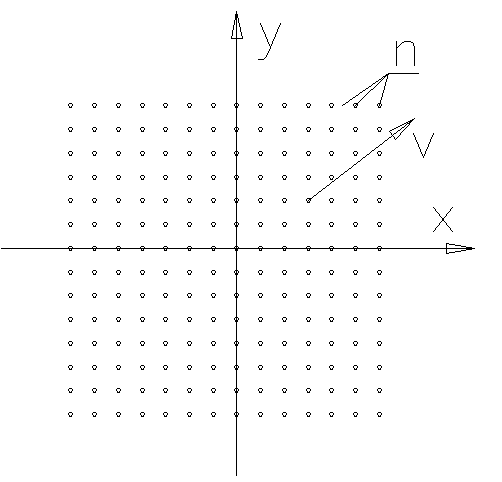
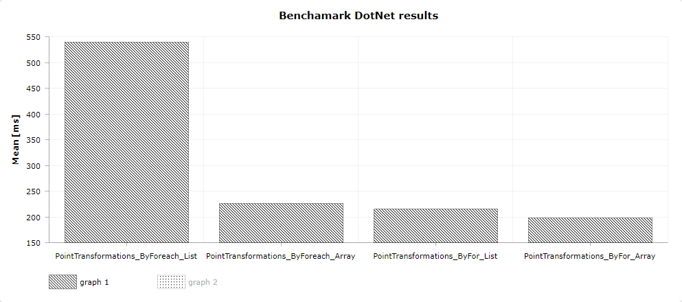
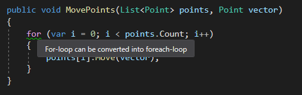

# Foreach vs for 

<!-- Id: foreach-vs-for  -->
<!-- Categories: Performance, C#, BenchmarkDotNet -->
<!-- Date: 20200508  -->

<!-- #header -->
Foreach loop is probably more often chosen that for loop maybe because there is less code to be written to achieve seemingly the same. But somethimes is worth to thing a little bit more before good choice is made especially when considerable number of loops is at stake. And during thinking process is good to have decent knowledge at hand.
<!-- #endheader -->

After watching [How to Write Very Fast C# Code](https://www.youtube.com/watch?v=-H5oEgOdO6U) on You Tube where _foreach_ vs _for_ topic was discussed, I decided to do some tests on my own.

I have **1'000'000** points placed on 2D plane like on image below and I want to move all points by vector **v(5,5)**.



I have dedicated method for this operation and it's part of class. 

```csharp
public class Point
{
    public int X { get; set; }
    public int Y { get; set; }

    public void Move(Point vector)
    {
        X += vector.X;
        Y += vector.Y;
    }
}
```

Now I will try do this operation in four ways, using _for_ and _foreach_ loops against ```Point[]``` array and ```List<Point>``` collections which combined give us 4 methods as below:

1. _foreach_ over _collection_

```csharp
public void MovePoints(List<Point> points, Point vector)
{
    foreach (var point in points)
    {
        point.Move(vector);
    }
}
```

2. _foreach_ over _array_

```csharp
public void MovePoints(Point[] points, Point vector)
{
    foreach (var point in points)
    {
        point.Move(vector);
    }

}
```

3. _for_ over _collection_

```csharp
public void MovePoints(List<Point> points, Point vector)
{
    for (var i = 0; i < points.Count; i++)
    {
        points[i].Move(vector);
    }
}
```

4. _for_ over _array_

```csharp
public void MovePoints(Point[] points, Point vector)
{
    for (var i = 0; i < points.Length; i++)
    {
        points[i].Move(vector);
    }
}
```

I will use [BenchmarkDotNet](https://github.com/dotnet/BenchmarkDotNet) to do all measures. As I already described this tool in dedicated [article](/post/benchmark-dot-net) I will spare you details all the more it's quite easy to setup config and run tests.

After setup, run and lots of calculations final metrics are displayed:

```
|                               Method |     Mean |    Error |    StdDev | Gen 0 | Gen 1 | Gen 2 | Allocated |
|------------------------------------- |---------:|---------:|----------:|------:|------:|------:|----------:|
|  PointTransformations_ByForeach_List | 539.1 ms | 89.80 ms | 264.78 ms |     - |     - |     - |         - |
| PointTransformations_ByForeach_Array | 226.3 ms | 35.54 ms | 104.78 ms |     - |     - |     - |         - |
|      PointTransformations_ByFor_List | 215.6 ms | 35.91 ms | 105.89 ms |     - |     - |     - |         - |
|     PointTransformations_ByFor_Array | 198.4 ms | 29.57 ms |  87.18 ms |     - |     - |     - |         - |
```



```Foreach over list``` has apparently slower performance than others. Is it because of _List_ or is it because of _foreach_ loop ? 

To answer this question let's take a look at _IL code_ and compare ```foreach over list``` code ...

```code
.method public hidebysig newslot virtual final 
        instance void  MovePoints(class [System.Collections]System.Collections.Generic.List`1<class FunkyCode.Performance.Point> points,
                                  class FunkyCode.Performance.Point 'vector') cil managed
{
  // Code size       56 (0x38)
  .maxstack  2
  .locals init (valuetype [System.Collections]System.Collections.Generic.List`1/Enumerator<class FunkyCode.Performance.Point> V_0,
           class FunkyCode.Performance.Point V_1)
  IL_0000:  nop
  IL_0001:  nop
  IL_0002:  ldarg.1
  IL_0003:  callvirt   instance valuetype [System.Collections]System.Collections.Generic.List`1/Enumerator<!0> class [System.Collections]System.Collections.Generic.List`1<class FunkyCode.Performance.Point>::GetEnumerator()
  IL_0008:  stloc.0
  .try
  {
    IL_0009:  br.s       IL_001d
    IL_000b:  ldloca.s   V_0
    IL_000d:  call       instance !0 valuetype [System.Collections]System.Collections.Generic.List`1/Enumerator<class FunkyCode.Performance.Point>::get_Current()
    IL_0012:  stloc.1
    IL_0013:  nop
    IL_0014:  ldloc.1
    IL_0015:  ldarg.2
    IL_0016:  callvirt   instance void FunkyCode.Performance.Point::Move(class FunkyCode.Performance.Point)
    IL_001b:  nop
    IL_001c:  nop
    IL_001d:  ldloca.s   V_0
    IL_001f:  call       instance bool valuetype [System.Collections]System.Collections.Generic.List`1/Enumerator<class FunkyCode.Performance.Point>::MoveNext()
    IL_0024:  brtrue.s   IL_000b
    IL_0026:  leave.s    IL_0037
  }  // end .try
  finally
  {
    IL_0028:  ldloca.s   V_0
    IL_002a:  constrained. valuetype [System.Collections]System.Collections.Generic.List`1/Enumerator<class FunkyCode.Performance.Point>
    IL_0030:  callvirt   instance void [System.Runtime]System.IDisposable::Dispose()
    IL_0035:  nop
    IL_0036:  endfinally
  }  // end handler
  IL_0037:  ret
} // end of method PointTransformations_ByForeach::MovePoints
```

... against ```for over list```:

```code
.method public hidebysig newslot virtual final 
        instance void  MovePoints(class [System.Collections]System.Collections.Generic.List`1<class FunkyCode.Performance.Point> points,
                                  class FunkyCode.Performance.Point 'vector') cil managed
{
  // Code size       39 (0x27)
  .maxstack  2
  .locals init (int32 V_0,
           bool V_1)
  IL_0000:  nop
  IL_0001:  ldc.i4.0
  IL_0002:  stloc.0
  IL_0003:  br.s       IL_0019
  IL_0005:  nop
  IL_0006:  ldarg.1
  IL_0007:  ldloc.0
  IL_0008:  callvirt   instance !0 class [System.Collections]System.Collections.Generic.List`1<class FunkyCode.Performance.Point>::get_Item(int32)
  IL_000d:  ldarg.2
  IL_000e:  callvirt   instance void FunkyCode.Performance.Point::Move(class FunkyCode.Performance.Point)
  IL_0013:  nop
  IL_0014:  nop
  IL_0015:  ldloc.0
  IL_0016:  ldc.i4.1
  IL_0017:  add
  IL_0018:  stloc.0
  IL_0019:  ldloc.0
  IL_001a:  ldarg.1
  IL_001b:  callvirt   instance int32 class [System.Collections]System.Collections.Generic.List`1<class FunkyCode.Performance.Point>::get_Count()
  IL_0020:  clt
  IL_0022:  stloc.1
  IL_0023:  ldloc.1
  IL_0024:  brtrue.s   IL_0005
  IL_0026:  ret
} // end of method PointTransformations_ByFor::MovePoints
```

_Foreach_ loop uses generic enumerator with _GetEnumerator()_, _get_Current()_ and _MoveNext()_ methods that produces more overhead that simple _for_ loop. _For_ doesn't require any specialized classes.
But what about ```foreach over array```? For that case C# compiler is smart enough to generate _for_ loop behind the scenes.

During implementation of these benchmarks I was tempted by _Resharper_ to "refactor" code to _foreach_ 



but have already this knowledge in mind --- I resisted :)

##### Summary

I haven't choosen this example by chance. Couple of years ago I developed application with _moving points_ feature and, as you gather I experienced performance problems. I got out of this problem by showing only contours during moving. But changing _foreach_ to _for_ would have been much more simplier and faster.


