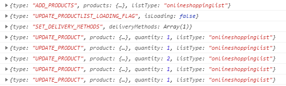
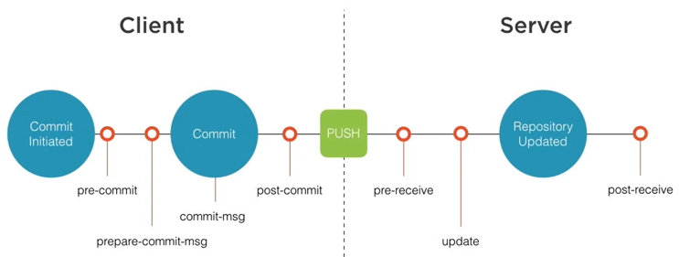

# Hello Git Hooks

<!-- Id: react-hooks  -->
<!-- Categories: Git  -->
<!-- Date: 20200328  -->

<!-- #header -->
<!-- #endheader -->


Despite all great debug and inspecting tools I guess that all of use ```console.log``` from time to time. Also from time to time all of us forget to remove it before production release.

Recently I was making order in one of biggest online shop and see what I accidentally found:



So it would be great there is possibility to do some source code validation before it is commited. To my relief Git has inbuilt feature to intercept Git workflow.

https://git-scm.com/book/en/v2/Customizing-Git-Git-Hooks




