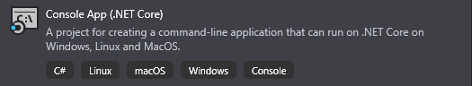
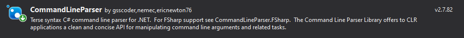
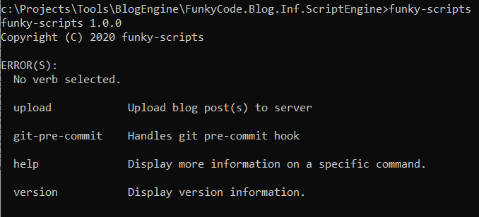

# Create Command Line Tool

<!-- Id: create-cmd-line-tool -->
<!-- Categories: Git -->
<!-- Date: 20200331 -->

<!-- #header -->
Tasks such as copying files and folders, compressing files, running unit tests and so on I used to fulfill via batch, PowerShell or [Cake](https://cakebuild.net/). I was wondering why not just to use .NET Core Console App and take advantage of great libraries to create full fledged scripting engine.
<!-- #endheader -->

This post is part of series:
1. [Hello Git Hooks](/post/git-hooks)
2. Create command line tool
3. [Git API](/post/git-api)

In [previous post](/post/git-hooks) I introduced Git Hooks - handlers for Git events which I intend to use to check content of the files which are about to be commited. So far I grasp only moment before commit is executed and promised to write logic in ```C#```.
Git Hook will _only_ invoke my ```command line tool``` which I create.

The simpliest command line tool is to create ```Console App``` project 



and manually parse incomming parameters which will come in ```args``` array.

``` csharp
class Program
{
    static void Main(string[] args)
    {
        // You can parse args if you want but better use dedicated library
    }
}
```

But for sure better way is to use dedicated library for handling all concerns regarding parameters - shortcuts, help, validation, default values etc. Personally, I use simple yet very effective and friendy [CommandLineParser](https://github.com/commandlineparser/commandline) tool which helps in managing command line tool arguments.



.NET Core 3.0 provides [in-built feature](https://docs.microsoft.com/en-usarchive/msdn-magazine/2019/march/net-parse-the-command-line-with-system-commandline) for handling command line parameters, but I will stay with ```CommandLineParser```. I thing this library is much more convenient for use as it is self-descriptive and allows me have all information about parameters and their settings in one file.

```CommandLineParser``` takes care only for command options, so there is freedom for create contracts for command with respect to their options.

``` csharp
public interface IConsoleCommand<in T> where T : OptionsBase
{
    int Execute(T options);
}
```

Our command will receive working directory as option. ```Verb``` represents alias for our command in case we have many command in single script.

``` csharp
public class GitPreCommitCommand : IConsoleCommand<GitPreCommitCommand.Options>
{
    [Verb("git-pre-commit", HelpText = "Handles git pre-commit hook")]
    public class Options : OptionsBase
    {
        [Option('d', "directory", Required = true, HelpText = "Git working directory")]
        public string WorkingDirectory { get; set; }
    }

    public int Execute(Options options)
    {
        /// TODO: implement in next post :)
        /// (...)
    }
}
```

Here's place where commands can be bind with input parameters. I also will use [Autofac](https://autofac.org/) for handling dependency injection.

``` csharp
internal class Program
{
    public static int Main(string[] args)
    {
        return Parser.Default.ParseArguments<UploadBlogArticleCommand.Options, GitPreCommitCommand.Options>(args)
            .MapResult(
                (UploadBlogArticleCommand.Options opts) => DoExecute(opts),
                (GitPreCommitCommand.Options opts) => DoExecute(opts),
                errs => 1);
    }

    static int DoExecute<TOptions>(TOptions options) where TOptions : OptionsBase
    {
        try
        {
            using var container = ConfigureContainer();
            using var scope = container.BeginLifetimeScope();
            var command = scope.Resolve<IConsoleCommand<TOptions>>();
            return command.Execute(options);
        }
        catch (Exception exc)
        {
            Console.WriteLine(exc.Message);
            return 1;
        }
    }

    static IContainer ConfigureContainer()
    {
        var builder = new ContainerBuilder();
        
        builder.RegisterAssemblyTypes(Assembly.GetExecutingAssembly())
            .AsImplementedInterfaces()
            .InstancePerLifetimeScope();
        
        var container = builder.Build();
        
        return container;
    }
}

```

When aplication is compiled and executed, ```CommandLineParser``` will take care of handling arguments input.



Command line tool is almost ready, only what is to be done is to make is executable single file.

I use [dotnet-warp](https://github.com/Hubert-Rybak/dotnet-warp) tool which is recommened by Scott Hanselman in this [post](https://www.hanselman.com/blog/MakingATinyNETCore30EntirelySelfcontainedSingleExecutable.aspx).
Tool should be run in folder which contains ```.sln``` or ```.csproj``` file.

``` code
dotnet tool install -g dotnet-warp
dotnet-warp
```

So far it's manual process, but after building project, it's only to type ```dotnet-warp``` to create single executable file.

We have now just engine for commands. It can be applied one by one to this engine along with need that would occur during project evolvement. But just now this executable file can be bound with ```pre-commit``` hook.

``` code 
#!/bin/sh

echo "executing pre-commit"

set -e

./FunkyCode.Blog.Inf.ScriptEngine/funky-scripts.exe git-pre-commit -d c:/Projects/Tools/BlogEngine
```

Ok, now we have our command line tool executed whenever ```git commit``` is about to be perfomed. Still theres no logic, but this will be completed in [next post](/post/git-api).


    


