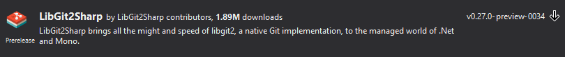

# Git API

<!-- Id: git-api  -->
<!-- Categories: Git  -->
<!-- Date: 20200401  -->

<!-- #header -->
TODO:
<!-- #endheader -->

This post is part of series:
1. [Hello Git Hooks](/post/git-hooks)
2. [Create command line tool](/post/create-cmd-line-tool)
3. [Git API](/post/git-api)




It's only to instatiate ```Repository``` class with ```.git``` folder path.

``` csharp
var repo = new Repository(gitPath);
```

Now we have access to all ```git``` data.


We can check which branch is current and skip validation when it's not ```master``` branch.

``` csharp
var currentBranch = repo.Branches.First(b => b.IsCurrentRepositoryHead);
if (currentBranch.FriendlyName != "master") return 0;
```

Let's get files to be commited which we need to validate.

``` csharp
var fileStatus = repo.RetrieveStatus();

var filesToCheck = fileStatus
    .Where(f => f.State != FileStatus.Ignored)
    .Where(f => FileExtensions.Contains(Path.GetExtension(f.FilePath)))
    .ToList();
```

And now we got filtered paths to files to check. Of course we can write sophisticated logic for different cases. But it can be also as siple as below.

``` csharp
bool CheckIsNoToDoInFile(string filePath)
{
    var lines = File.ReadAllLines(filePath);
    return lines.All(line => !line.Contains("console.log"));
}
```
