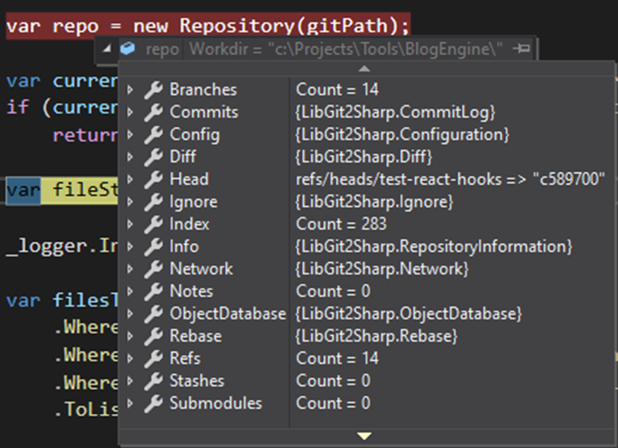

# Git API

<!-- Id: git-api  -->
<!-- Categories: Git  -->
<!-- Date: 20200401  -->

<!-- #header -->
To complete my task I need to find a way how to obtain data from Git. All Git informations are kept in files in .git folder which is part of every project under Git version control. Let's take look at [LibGitSharp](https://github.com/libgit2/libgit2sharp) - probably most popular .NET library for interoping with Git.
<!-- #endheader -->

This post is the part of series:
1. [Hello Git Hooks](/post/git-hooks)
2. [Create command line tool](/post/create-cmd-line-tool)
3. Git API

Among couple of .NET libraries for manipulation with Git by C# ```LibGitSharp``` seems to best solution. It has almost 2M downloads, so it's now so weird idea to speak with Git in C# language.


Usage is pretty straight forward especially for read-only operatons. It's only to instatiate ```Repository``` class with ```.git``` folder path.

``` csharp
var repo = new Repository(gitPath);
```

Now we have access to all Git data.



We can check which branch is current and skip validation when it's not ```master``` branch.

``` csharp
var currentBranch = repo.Branches.First(b => b.IsCurrentRepositoryHead);
if (currentBranch.FriendlyName != "master") return 0;
```

Let's get files to be commited which we need to validate.

``` csharp
var fileStatus = repo.RetrieveStatus();

var filesToCheck = fileStatus
    .Where(f => f.State != FileStatus.Ignored)
    .Where(f => FileExtensions.Contains(Path.GetExtension(f.FilePath)))
    .ToList();
```

And now we got filtered paths to files to check. Of course we can write sophisticated logic for different cases. But it can be also as siple as below.

``` csharp
bool CheckIsNoToDoInFile(string filePath)
{
    var lines = File.ReadAllLines(filePath);
    return lines.All(line => !line.Contains("console.log"));
}
```

I will apply this code to ```GitPreCommitCommand``` which I created in [previous post](/post/create-cmd-line-tool). After recompiling and **rewarping** tool is ready to be used.

### Summary

My mission is completed. I created mechanism that will prevent myself for commiting files containing ```console.log```  statements to Git repository. To some extend it is overkill - it can be performed in ```pre-commit``` Git Hook directly. But I created robust engine for executing console commands which can be extended in future.

