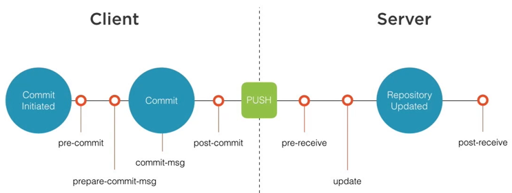
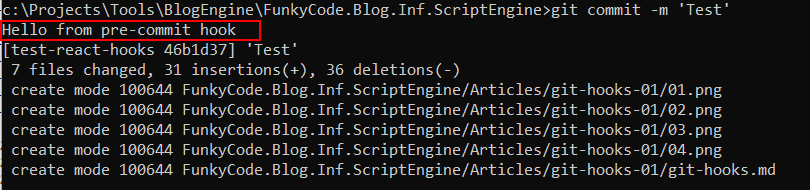

# Hello Git Hooks

<!-- Id: git-hooks -->
<!-- Categories: Git -->
<!-- Date: 20200330 -->

<!-- #header -->
TODO:
<!-- #endheader -->

This post is part of series:
1. [Hello Git Hooks](/post/git-hooks)
2. [Create command line tool](/post/create-cmd-line-tool)
3. [Git API](/post/git-api)


Despite all great debug and inspecting tools I guess that all of use ```console.log``` from time to time. Also from time to time all of us forget to remove it before production release.

Recently I was making order in one of biggest online shop and see what I accidentally found:


So it would be great there is possibility to do some source code validation before it is commited. To my relief Git has inbuilt feature to intercept Git workflow and feature name is [Git Hooks](https://git-scm.com/book/en/v2/Customizing-Git-Git-Hooks).

There are two kinds of Git Hooks, Client-Side Hooks and Server-Side hooks. Client-Side Hooks are not copied when repository is cloned. Of course Server-Side Hooks implemented on git server can give us better control over whole team activities. But assumming that there's no such possibility during to policy restrictions Client-Side Hooks can be one solution.



To start with Git Hooks, let's dive into ```.git``` folder which is part of every project under Git source control.

i

Hooks are represented with files with names corresponding to moment in workflow when they are fired. 


By default hooks are disabled. To enable hook simply remove ```.sample``` file extension and edit file content as it contains exemplary code.

Let's check if it really works. Here's the simplest implementation of ```pre-commit``` hook.

```code
#!/bin/sh
echo "Hello from pre-commit hook"
```

And after commiting it seems that it works.



Now let's acquire control over commit process. Code below will prevent commit in **any** case:

```code
#!/bin/bash
echo "Hello from pre-commit hook"
echo "Commit will be interrupted."
exit 1
```


Of course it also works when trying to commit from [SourceTree](https://www.sourcetreeapp.com/) which I use as Git shell.


Now we need some logic to determine if we need to prevent from commiting or not. 
Personally I like using ```C#``` where possible, so I will use ```pre-commit``` only as launcher of my ```C#``` command line tool which will do the most of the job.


