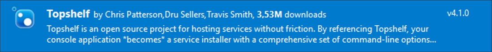
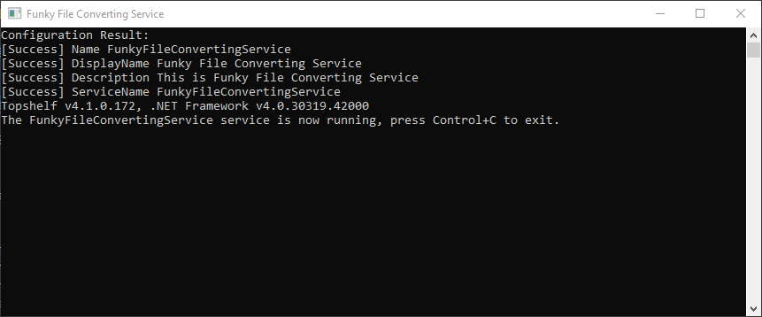
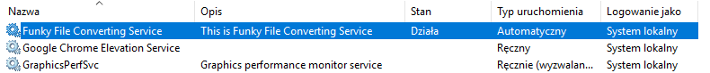

# Hello Topshelf

<!-- Id: hello-topshelf  -->
<!-- Categories: Design patterns, Testing  -->
<!-- Date: 20200319  -->

<!-- #header -->
Topshelf framework simplifies creating, installing and managing Windows services. Finally, you do not need to click in Services Control Manager, remember what was that command to install and start service.
Everything that is to be done is to define what you want in fluent configuration, without any detailed knowledge about Windows services infrastructure. From now they are just like console applications.
<!-- #endheader -->

A typical scenario when using Topshelf:

1. Create Console Application
2. Install Topshelf NuGet
3. Create Service Class
4. Write Service Logic Code

## Developing service

Here’s a screenshot from NuGet package. You need to install it.



As usual, I do not start without an interface.

``` csharp
public interface IWindowsService
{
        bool Start();
        bool Stop();
}
```

I created simple service to watch for *.txt files in a specific directory and changes the text to uppercase.
I won’t copy it here, you can get it from GitHub. It just implements IWindowsService interface.

``` csharp
class Program
{
    static void Main(string[] args)
    {
        HostFactory.Run(configuration =&gt; {
            configuration.Service&lt;FunkyFileConvertingService&gt;(instance =&gt;
            {
                instance.ConstructUsing(() =&gt; new FunkyFileConvertingService(new ToUpperConvertingService()));
                instance.WhenStarted(i =&gt; i.Start());
                instance.WhenStopped(i =&gt; i.Stop());
            });
    
            configuration.SetServiceName("FunkyFileConvertingService"); // &lt;- remember, no spaces!
            configuration.SetDisplayName("Funky File Converting Service");
            configuration.SetDescription("This is Funky File Converting Service");
        });
    }
}
```

Although there are advanced configuration options, the code above is enough to create full-fledged service.

## Debugging service

To debug your service just type F5. Topshelf will emulate your service working as installed.



## Launching service

You are not going to use **sc** nor **net** commands. You use the name of your service as a command with parameters specified below.

``` cmd
Command-Line Reference
 
  <yourservice>.exe [verb] [-option:value] [-switch]
 
    run                 Runs the service from the command line (default)
 
    help, --help        Displays help
 
    install             Installs the service
 
    start               Starts the service if it is not already running
       
    stop                Stops the service if it is running
 
    uninstall           Uninstalls the service
```

To install service you need to run cmd as administrator.
Run services to check if service is installed.



## Sending custom command to service

Services have a feature of accepting receiving of custom commands even when they are working.
There are a lot of limitations – they accept only numbers and give no responses. But still, in some scenarios, it can be useful.
Add method as below to your interface and implementation.

``` csharp
configuration.Service&lt;FunkyFileConvertingService&gt;(instance =&gt;
{
    instance.ConstructUsing(() => new FunkyFileConvertingService(new ToUpperConvertingService()));
    instance.WhenStarted(i => i.Start());
    instance.WhenStopped(i => i.Stop());

    // n in range (128;255)
    instance.WhenCustomCommandReceived((i, c, n) => i.CustomCommandReceived(n));
});
```

Here’s syntax for sending commands to service from command line.

``` cmd
sc control [ServiceName] 150
```


