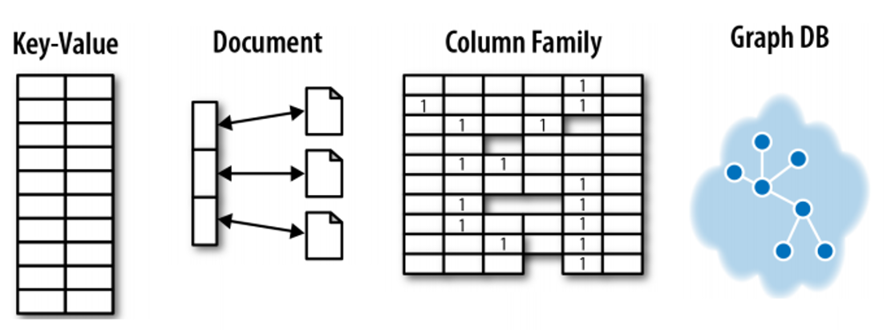
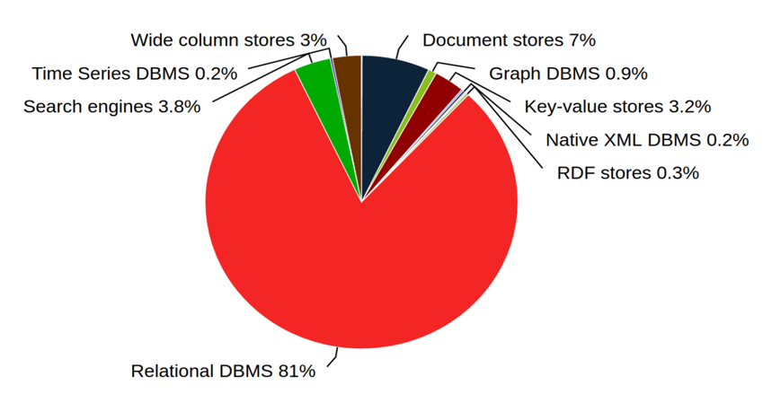
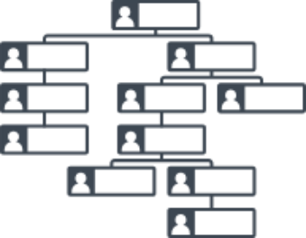
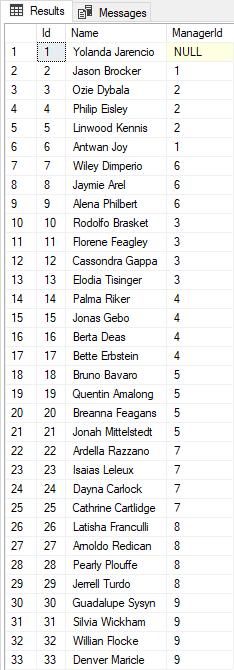
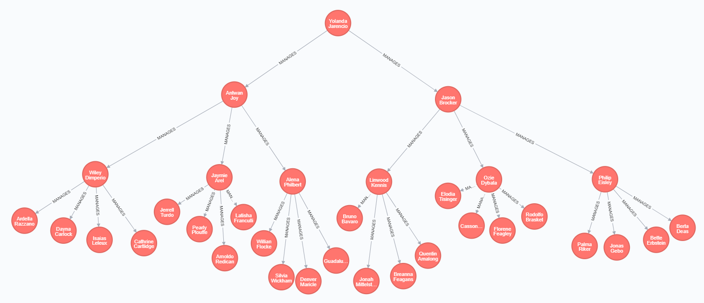

# Hello Neo4j

<!-- Id: neo4j-01  -->
<!-- Categories: NoSql  -->
<!-- Date: 20200319  -->

<!-- #header -->
Neo4j is representative for graph databases, which are of four main types of NoSQL databases.
<!-- #endheader -->



Graph databases are usually mentioned as the last item of this list and as we see below, there are not so popular comparing to SQL and other NoSQL databases



But what for me was very noticeable that usability and scenarios where graph databases will be a better choice than SQL databases are understandable very fast.

Here is my private rank ordered by the speed of comprehension:

1. Graph databases
2. Key-value stores
3. Document databases
4. Column storages

So, in general, is not a bad choice to start with Neo4j when you want to enter the world of NoSQL. Other storage types have much more in common with SQL so at first glance, you may not see a sense of considering these technologies as alternatives to SQL.

NoSQL databases are not to replace but to complete SQL databases in some scenarios. It’s not like ASP.NET MVC replacing Web Forms, it’s more like VS Code complementing Visual Studio – both products seem to have a great future.

Some Neo4j characteristics in a nutshell:

- Based on graph theory
- Allow simple and fast retrieval of complex hierarchical structures that are difficult to model in relational systems.
- Easy model maintenance
- Easy query
- Ultra high performance
- Minimal resource usage
- Contains nodes and relationships (edges)
- Nodes and relationship contains name-value properties
- Relationships are named and directed with start and end
- Uses Cypher Query Language

Let’s assume we got org chart to store.



Your org chart in Management Studio will look like that:



Whereas org chart in Neo4j Browser (which is analogue to Management Studio) will look like that:



### Cypher

Cypher is query language for Neo4j. Unlike languages in other NoSQL storages, it has nothing in common with SQL. Especially Cassandra’s CQL (Cassandra Query Language) is very close to SQL (with no joins).
Here is a completely different attitude, as in snippet below.

```sql
MATCH (user)-[:friend]->(follower)
WHERE user.name IN ['Joe', 'John', 'Sara', 'Maria', 'Steve'] AND follower.name =~ 'S.*'
RETURN user.name, follower.name
```

