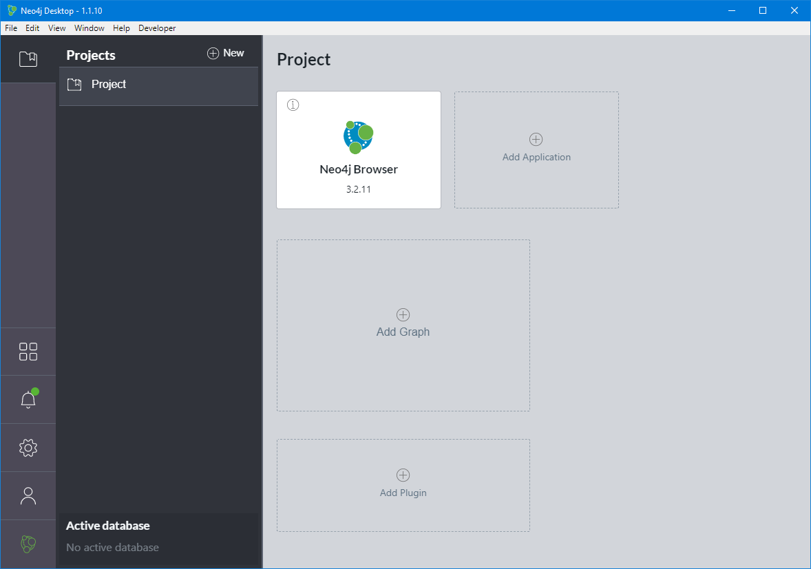
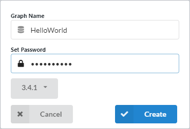
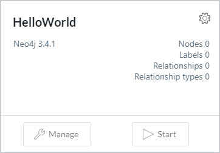
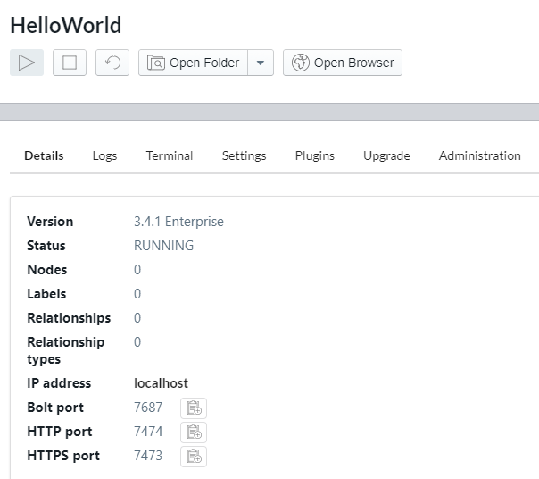
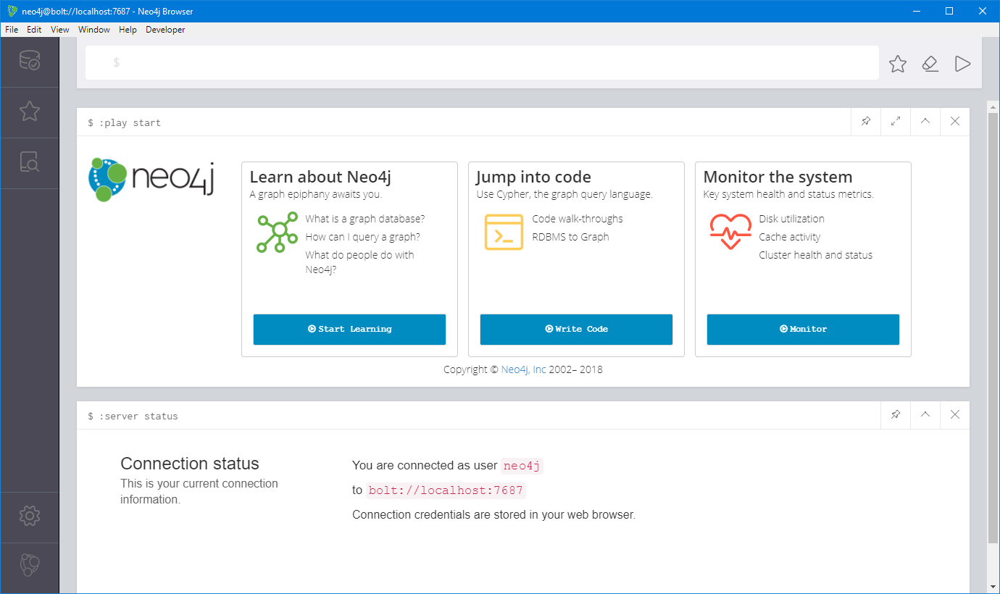
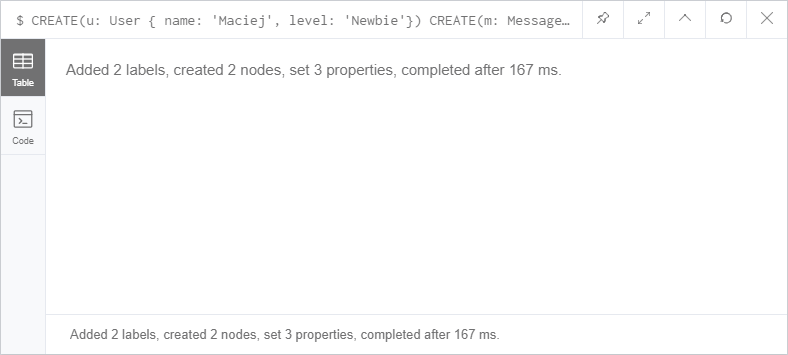
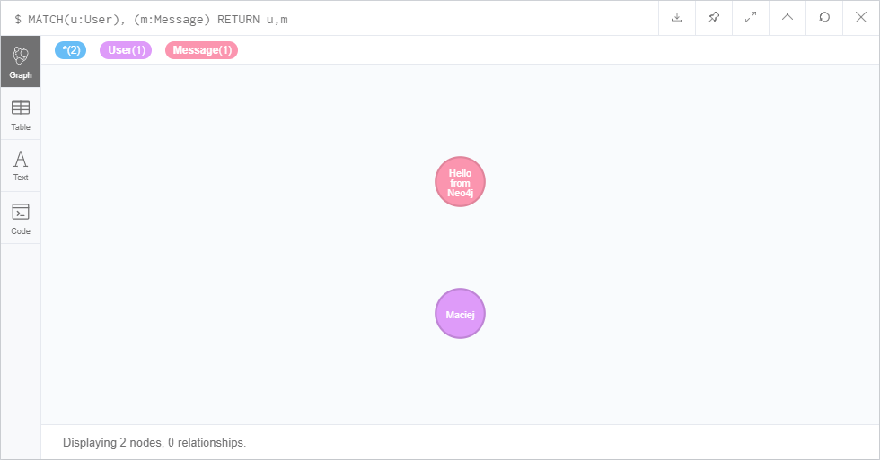

# Hello Neo4j

<!-- Id: neo4j-02  -->
<!-- Categories: NoSql, neo4j  -->
<!-- Date: 20200319  -->

<!-- #header -->
In this post, I am going to walk you through Neo4j installation and first queries.
<!-- #endheader -->

1. Go to https://neo4j.com/download/



2. After quick, seamless installation process, you will see Neo4j desktop

3. To add a new database click Add Graph, then Create a Local Graph.

4. Type database name, and password.



5. Click Start to launch database.



6. Click Manage on your database widget, then click Open Browser.



Now you are ready to create objects in your database.



7. In command line (started with $) create User instance and Message instance using Cypher language.

```sql
CREATE (u: User { name: 'Maciej', level: 'Newbie'})
CREATE (m: Message { text: 'Hello from Neo4j'})
```

You see that something created but there are no visual results.



8. To see visual output result you need to use RETURN statement. Type following code:

```sql
MATCH (u:User), (m:Message)
RETURN u,m
```

Now finally we can see visual results.



9. Finally, we can create a relation.


