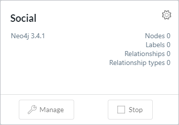
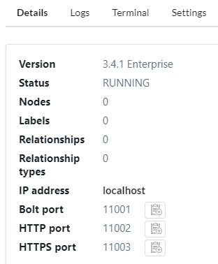
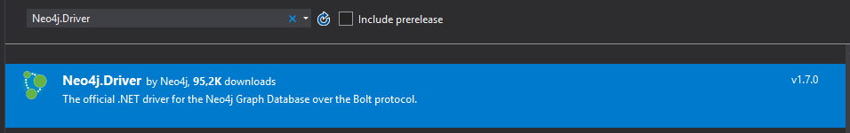
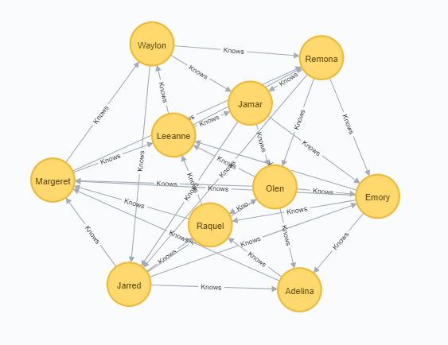

# Neo4j (#3) .NET Driver

<!-- Id: neo4j-03  -->
<!-- Categories: NoSql, neo4j  -->
<!-- Date: 20200319  -->

<!-- #header -->
In this post I will connect with Neo4j from .NET application.
<!-- #endheader -->


In this post I will connect with Neo4j from .NET application.

I will try to generate social network structure – one of most exemplary use case for applying Neo4j.

We will use Neo4j.Driver:

- officially supported by Neo4j
- connects to the database using the binary protocol
- it aims to be minimal – suports query execution, materialize results into .NET objects, sessions etc. – something like ADO.NET

So, let’s start.

1. Create Social database with social password.



2. Click Manage and take look at Bolt, you will need password and Bolt while connection from .NET application.



3. Open Visual Studio and install Neo4j.Driver nuget package.



4. I separated generating and executing Cypher statements. Here is generation:

``` csharp
public static List&amp;amp;lt;string&amp;amp;gt; GenerateCypherStatements()
{
    var numberOfPersons = 10;
    var minKnownPersons = 2;
    var maxKnownPersons = 6;

    var random = new Random(DateTime.Now.Millisecond);
    var randomNameGenerator = new PersonNameGenerator();

    var statements = new List&amp;amp;lt;string&amp;amp;gt;();
    for (int i = 1; i &amp;amp;lt;= numberOfPersons; i++)
    {
        var name = randomNameGenerator.GenerateRandomFirstName();
        var statement = $"CREATE (p:Person {{id:{i},  name:\"{name}\" }})";
        statements.Add(statement);
    }

    for (int i = 1; i &amp;amp;lt;= numberOfPersons; i++)
    {
        int numberOfPersonKnown = random.Next(minKnownPersons, maxKnownPersons);

        for (int j = 1; j &amp;amp;lt;= numberOfPersonKnown; j++) { int destinationPersonId = i + j; if (destinationPersonId &amp;amp;gt; numberOfPersons)
                destinationPersonId = destinationPersonId - numberOfPersons;

            string statement = $@"MATCH (s:Person),(d:Person)
                                  WHERE s.id = {i} AND d.id = {destinationPersonId}
                                  CREATE (s) -[r: Knows]-&amp;amp;gt; (d)";
            statements.Add(statement);
        }
    }

    return statements;
}
```

5. … and here’s execution of above generated statements.

``` csharp
public static void ExecuteStatements(List&amp;amp;lt;string&amp;amp;gt; statements)
{
    var user = "neo4j";
    var password = "social";
    var uri = "bolt://localhost:11001";

    using (IDriver driver = GraphDatabase.Driver(uri, AuthTokens.Basic(user, password)))
    {
        using (var session = driver.Session())
        {
            session.WriteTransaction(tx =&amp;amp;gt;
            {
                foreach (var statement in statements)
                {
                    tx.Run(statement);
                }
            });
        }
    }
}
```

6. After executing code above, go to Neo4j Browser. You won’t see anything unless you type Cypher statement as below.

``` code
MATCH (n)
RETURN (n)
```



7. When you get bored with this and want to run again, use this snippet.

``` code
MATCH (n)
DETACH DELETE n
```

### Other frameworks

There are other alternatives, unofficial yet much more robust developed by community.

Neo4jClient – https://github.com/Readify/Neo4jClient
Cypher.NET – https://github.com/mtranter/CypherNet


