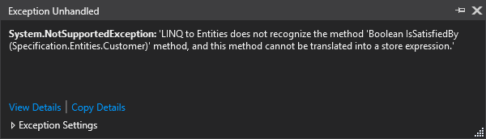

# Design patterns: Specification

<!-- Id: patterns-specification  -->
<!-- Categories: Design patterns -->
<!-- Date: 20180612  -->

<!-- #header -->
TODO
<!-- #endheader -->

Let’s assume we have following business requirement:

When a customer has 10 accounts or more, he becomes a premium customer and must be informed about this.

``` csharp
public void OnLogging(Customer customer)
   {
       // (...)
 
       if (customer.Accounts.Count >= 10)
           ConvertToPremiumCustomer(customer);
 
       // (...)
   }

```

After deployment, everything works great, but here’s another business requirement:

Many of our customers don’t log often, so let’s check every week if they are fit to become a premium customer and send them an email.

So implementation could look like this:


``` csharp
public void Start()
{
    using (var context = new Context())
    {

        var customersToBecomePremium = context.Customers
            .Where(c => c.Accounts.Count >= 10)
            .ToList();

        Notify(customersToBecomePremium);
    }
}
```

Everything works fine. But after some time, there’s another requirement: number of accounts, when customer is qualified as premium customer should be changed from 10 to 12.
The previous developer left for another company. No problem – we got the new one. There he is, making changes like this:

``` csharp
public void OnLogging(Customer customer)
{
    // (...)

    if (customer.Accounts.Count >= 12)
        ConvertToPremiumCustomer(customer);

    // (...)
}
```

Problem is, that he had no idea about working service with notification.
So now we have 12 account limit when he is logging, and 10 accounts limit when service checks for customers to notify.

Solution: specification pattern.

Let’s do this as simple as it can be.
Here’s interface:

``` csharp
public interface ISpecification<T>
{
    bool IsSatisfiedBy(T entity);
}
```

… and here is implementation.

``` csharp
public class SendInfoSpecification : ISpecification<Customer>
    {
        public bool IsSatisfiedBy(Customer customer)
        {
            return customer.Accounts.Count > 10;
        }
    }
```

For in-memory operations it is ok, but when you are new to LINQ and/or Entity Framework you will sooner or later experience this exception:



That means LINQ doesn’t know how to translate it into SQL. We will talk about it in future.

So we need to enable LINQ to use our condition:

Here’s abstraction:

``` csharp
public abstract class Specification0<T> : ISpecification<T>
{
      public bool IsSatisfiedBy(T entity)
      {
          Func<T, bool> predicate = ToExpression().Compile();
          return predicate(entity);
      }
 
      public abstract Expression<Func<T, bool>> ToExpression();       
}
```

… and implementation:

``` csharp
public class SendInfoSpecification : Specification<Customer>
{
    public override Expression<Func<Customer, bool>> ToExpression()
    {
        return customer => customer.Accounts.Count > 10;
    }
}
```

So the implementation of Start() method will be slightly different.

``` csharp
public void Start()
{
    using (var context = new Context())
    {

        var customersToBecomePremium = context.Customers
            .Where(_sendInfoSpecification.ToExpression())
            .ToList();

        Notify(customersToBecomePremium);
    }
}
```

Combining Specification Pattern and Repository Pattern

Specification Design Pattern can be easily combined with Repository Pattern.
You can simply extend your IRepository<T> whatever it look like, with something like this:

``` csharp
public interface ISpecifiableRepository<T>
{
    IList<T> GetBySpecification(ISpecification<T> specification);
}
```


