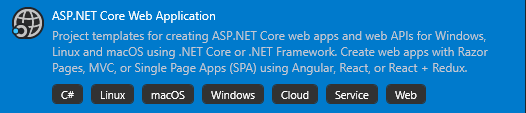
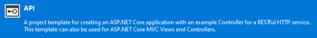
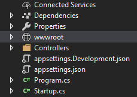
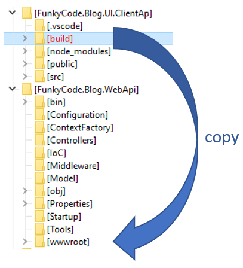
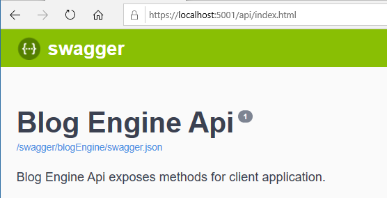

# Integrate React application with .NET Core API

<!-- Id: react-aspnetcoreapi-integration -->
<!-- Categories: React, ASP.NET Core -->
<!-- Date: 20200402 -->

<!-- #header -->
In this post I will show how easy is to integrate React client application with Server Web ASP.NET Core API and host this app with sweet harmony with .NET Core App on IIS.
<!-- #endheader -->

React applications are commonly developed in node.js environment using Visual Studio Code. Visual Studio also offers features to help building React applications, but as far as I know, development experience is not very astounding.
Full stack developers (me included) often develop client-server apps in this fashion:
* React client in node.js using Code and 
* Server API in C#/ASP.NET Core using Visual Studio

I noticed that there are **two major mistunderstandings** mostly among developers who have tinkered a little bit with React but didn't had occasion to dive deeply in this topic especially in deployment to production process.

##### 1. node.js is necessary to host React application

Node.js along with WebPack, Babel and other tools is necessary in development process. React application in the end of the day is minified to single ```.js``` file.

##### 2. React is very complicated tool consist of thousands of files and libraries

This is true, but it's not React itself but rather React development environment. 
I checked number of files in my React Blog Engine project and here's table with comparison:

<table>
<tr><td>Development</td><td>Release/Production</td></tr>
<tr><td>64255</td><td>18</td></tr>
</table>

So as finally React application is pure JavaScript there are no obstacles to host on IIS along with .NET Core Web Api application.
This is the simpliest solution, probably not suitable for big commercial apps requires really few steps to get things done.

#### React Application

If you create your application with [Create React App](https://create-react-app.dev/) there's simple statement to create build.

``` code
npm run build
```

Package will be created under ```./build``` folder of React app project.

#### ASP.NET Core Web Application

For ASP.NET Core Web Applications



with ```API``` as option



there's no ```wwwroot``` folder, but there's no problem - **it can be created manually!**.



To invite React client app to ASP.NET Core app we need to do some slight preparations in ```Startup.cs``` class.


``` csharp
public void Configure(IApplicationBuilder app, IWebHostEnvironment env)
{
    /// (...)
    
    var defaultFileOptions = new DefaultFilesOptions();
    defaultFileOptions.DefaultFileNames.Clear();
    defaultFileOptions.DefaultFileNames.Add("index.html");
    app.UseDefaultFiles(defaultFileOptions);
    app.UseStaticFiles();

    /// (...)
}
```

Please notice that we no not need to specify any link to ```wwwroot``` as it is default directory for static web content.

#### Integration

Simply copy whole content of ```build``` folder into ```wwwroot``` folder. 
Here's example how it works in my React Blog Engine app:



ASP.NET Core Web Application will start as usually



but after changing URL like below React client application will be displayed.


There's great advantage in this attitude that we can forget about CORS and talk to Server REST Api using relative urls. 
Hover when you back to development under ```node.js```, React client app will probably on ```localhost:3000``` and you will need absolute urls again.
Here's trick to faciliate this problem

``` javascript
getRoot() : string
{
    if (process.env.NODE_ENV === 'development')
        return 'https://localhost:5001'; 
    else  (process.env.NODE_ENV === 'production')
        return ''; 
   
    /// (...)
}
```

Notice that ```'production'``` means that there is built (bundled) version of application.


