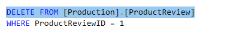

# SQL Database Reset

<!-- Id: sql-database-reset -->
<!-- Categories: SQL, Testing -->
<!-- Date: 20200818 -->

<!-- #header -->

When I started my adventures with SQL I made mistake of reading books without taking exercises included which is rather not productive as after hours of reading I was unable to write simple SELECT query. Main reason for that was that I was discouraged of discrepancies between expected data results shown in the book and data on my screen. And reason for that discrepancies was that I already made some changes in schema or data structure from previous examples, especially when mistakes were made. What I wish to have feature to reset database to initial state with schema and data to start from beginning. 

<!-- #endheader -->

### Usage in SQL practicing

Here is typical example of mistake which probably any of us did, where whole table data was removed instead of single row.



A solution can be to drop and restore using SSMS but doing it many times also contributes do discouragement.

So what I propose is stored procedure below that allow you to quickly drop and recreate database whenever you wish.


```sql
USE [master]

DROP PROCEDURE IF EXISTS dbo.sp_dropRestoreDb
GO

CREATE PROCEDURE dbo.sp_dropRestoreDb
    @databaseName nvarchar(128),
    @backupPath nvarchar(max)  
AS
BEGIN

	DECLARE 
		@sql nvarchar(max),
		@backupFileName nvarchar(max),
		@backupFullPath nvarchar(max),
		@dataFileName nvarchar(max),
		@logFileName nvarchar(max),
		@dataFileFullPath nvarchar(max),
		@logFileFullPath nvarchar(max);

	IF DB_ID(@databaseName) is not null 
	BEGIN
		SET @sql = CONCAT('ALTER DATABASE ', @databaseName, ' SET single_user WITH ROLLBACK IMMEDIATE');
		EXEC sp_executesql @sql

		SET @sql = CONCAT('ALTER DATABASE ', @databaseName, ' SET OFFLINE;');
		EXEC sp_executesql @sql

		SET @sql = CONCAT('DROP DATABASE ', @databaseName, ';');
		EXEC sp_executesql @sql

		PRINT(CONCAT(@databaseName, ' dropped.'))
	END

	SET @backupFileName = @databaseName + '.bak';
	SET @backupFullPath = CONCAT(@backupPath, @backupFileName);
	
	SET @dataFileName = CONCAT(@databaseName, '_Data');
	SET @dataFileFullPath = CONCAT(@backupPath, @dataFileName, '.mdf');

	SET @logFileName = CONCAT(@databaseName, '_Log');
	SET @logFileFullPath = CONCAT(@backupPath, @logFileName, '.ldf');
	   	
		
	RESTORE DATABASE @databaseName FROM DISK = @backupFullPath WITH RECOVERY, REPLACE, STATS = 10,
	MOVE @dataFileName TO @dataFileFullPath,
	MOVE @logFileName TO @logFileFullPath;
	
	RETURN 0 
END 
GO

```

To speed up process even more why not to create another procedure dedicated for database you are working on.


```sql
USE [master]

DROP PROCEDURE IF EXISTS [dbo].[sp_dropRestoreAdventureWorks2016Db]
GO

CREATE PROCEDURE dbo.sp_dropRestoreAdventureWorks2016Db 
AS
   EXEC sp_dropRestoreDb 'AdventureWorks2016', 'c:\Db-backups\'
RETURN 0 
```

Having such a procedure at hand I have very big comfort working on database. Whenever I did something wrong I can quickly rewind to initial shape. I am still learning SQL and SQL Server maybe on some more advanced level.

### Usage in integration tests

Having this procedure ready it comes to my mind to use it in integration test project.

In integration tests there's good practice to have every test isolated. For a while I experimented with sequential tests, something like (1) Create Entity #1, (2) Update Entity #1 and so on, but for a long run it didn't pay. It's very hard to maintain it and very hard to know if undesired behavior is because of bug in logic or some bug in tests sequence. 

There are three methods how to assure integration test isolation:
1. **Unique data** - doing one test on Entity #1 and other on Entity #2 and wishing there will be no collisions 
2. **Transactions** - wrapping every test with BEGIN and ROLLBACK TRAN code, but that's not applicable when there's transaction logic inside test
3. **Recreating database** - that's what seems to be alternative solution which I would like to propose here. Probably it can't be applicable to large databases, but for sure for *AdventureWorks* it works fine. Assuming that there are no downsizes for dropping and recreating database hundreds of times it can be at least considered. 

Entity Framework Core offers quite fast way to create database context out of existing database. I only need couple of packages:


Then in Package Manager Console I can create context out of existing database. 

```
Scaffold-DbContext 'Server=(localdb)\MSSQLLocalDB;Initial Catalog=AdventureWorks2016; Integrated Security = True' Microsoft.EntityFrameworkCore.SqlServer -ContextDir Context -OutputDir Model -Context AdventureWorks2016DbContext -Force
```

Then I created ```NUnit``` test project in which database for every single test is recreated.


```csharp
[SetUp]
public void Init()
{
    using var conn = new SqlConnection(@"Server=(localdb)\MSSQLLocalDB;Initial Catalog=master; Integrated Security = True");
    using var cmd = new SqlCommand("sp_dropRestoreDb", conn) {CommandType = CommandType.StoredProcedure};

    conn.Open();

    cmd.Parameters.Add(new SqlParameter("@databaseName", "AdventureWorks2016"));
    cmd.Parameters.Add(new SqlParameter("@backupPath", "c:\\Db-backups\\"));
    
    cmd.ExecuteNonQuery();
}

[Test]
public void ProductReview_1_Should_Be_Removed()
{
    using var ctx = new AdventureWorks2016DbContext();
    var productReview = ctx.ProductReview.Find(1);
    ctx.ProductReview.Remove(productReview);
    ctx.SaveChanges();
}

[Test]
public void ProductReview_1_Should_Be_Updated()
{
    using var ctx = new AdventureWorks2016DbContext();
    var productReview = ctx.ProductReview.Find(1);
    productReview.Comments = "Updated";
    ctx.SaveChanges();
}

```

Before every test `Init()` method is launched which invokes stored procedure from listing above. We have full isolation assured and every test have the same setup of data.

#### Summary

Ability to quick database reset can make our daily life easier. Many practicing scenarios requires the same base point for comparisons and analysis. I cannot count number of times which I invoked this procedure after I created it in areas such as *transactions*, *statistics*, *indexes* and other. Database recreation can be also considered as a method for ensuring integration test isolation. I haven't encounter this attitude in my carrier but so far I can't see any disadvantages especially for small and middle databases.


