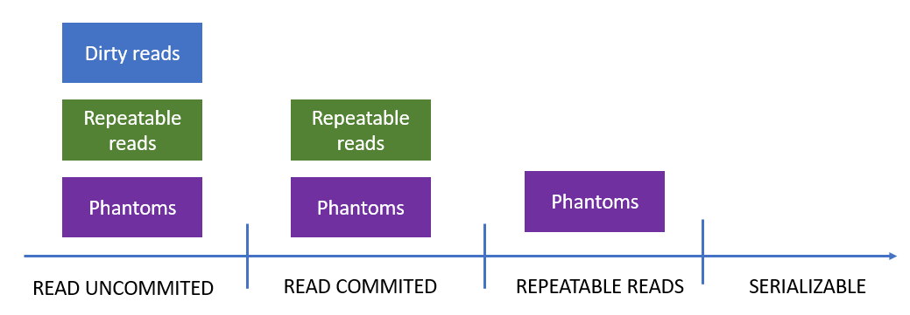

# SQL Isolation Levels

<!-- Id: sql-isolation  -->
<!-- Categories: SQL -->
<!-- Date: 20200728  -->

<!-- #header -->
Database isolation levels are discussed especially (1) during interviews and (2) when concurrency problems eventually occurs on production. In first case learning them by heart is enought but in second one it's good to have deep understanding about isolation levels and concurrency control because it's not a quick process to learn and especially understand that ideas. I recently spent time for PoC projects in which there was no budget for analysing application behaviour under high traffic. So this article is also for myself for mastering a little bit knowledge about concurrency control.
<!-- #endheader -->

In general there's several degrees of initiation in this area:
1. Knowing that isolation levels exist.
2. Learning isolation levels by heart (for interviews)
3. Have basic understanding of isolation levels (anomalies).
4. Have deep understanding of isolation levels (lock modes, locks hierarchy, lock escalation etc)
5. Have ability to choose proper isolation level in real life scenario.

This article assummes knowledge from points 1. and 2. and tries to provide knowledge on 3.

Isolation levels are created to protect database integrity agains anomalies which are undesired results of conflicts between concurrent transactions. There are 3 main anomalies:
1. Dirty reads
2. Unrepeatable reads
3. Phantoms


Isolation levels eliminates these anomalies one by another.



However there is the cost of this elimination which is... guess what... **performance**.

I will present all examples performing operation on single table. Here's snippet for this table. I can be dropped and recreated in-between all examples below. This is simple users table with name and information whether user is active or not. Users are heroes taken from my beloved [comic series](https://en.wikipedia.org/wiki/Tytus,_Romek_i_A%27Tomek). 


```sql
drop database if EXISTS [FunkyCode.IsolationLevels]

create database [FunkyCode.IsolationLevels]

drop table if EXISTS dbo.Users
GO

create table dbo.Users
(
  Id   INT identity (1,1) primary key,
  Name VARCHAR(30),
  IsActive bit
);
GO

insert into dbo.Users values 
('Tytus', 0),
('Romek', 0),
('A`Tomek', 0)
GO

select * from dbo.Users 
```

My target is to understand and make you understand behaviours of transaction under different isolation levels when one meets another in the same time. To understand it I will analyse these transaction in slow motion. 

To follow my idea please create database and table and open two query windows in SQL Server Management Studio. Then launch SQL query fragments in sequence denoted in comments selecting them and pressing ```ctr```+```e``` which allows to execute fragment of SQL query. I would recommend to organize SSMS in following way:


## Dirty reads

### Dirty reads problem

This example will demonstrate *dirty reads* phenomena. 

<table><tr><th> A </th><th> B </th></tr><tr><td valign='top'>

```sql
-- (1)
set transaction isolation level READ COMMITTED
begin transaction A 

-- (4)
update dbo.Users set IsActive = 1 where Id = 2

-- (6)
rollback transaction
```

</td><td valign='top'>

```sql
-- (2)
set transaction isolation level READ UNCOMMITTED

-- (3) 
select * from dbo.Users where Id = 2 -- IsActive = 0

-- (5)
select * from dbo.Users where Id = 2 -- IsActive = 1

-- (7)
select * from dbo.Users where Id = 2 -- IsActive = 0
```

</td></tr></table>

After (5) transaction B sees new data that is not commited. That is *dirty read*. In case when transaction A is aborted queried value will again changed.


### Dirty reads solution

<table><tr><th> A </th><th> B </th></tr><tr><td valign='top'>

```sql
-- (1)
set transaction isolation level READ COMMITTED
begin transaction A 

-- (4)
update dbo.Users set IsActive = 1 where Id = 2

-- (6)
rollback transaction
```

</td><td valign='top'>

```sql
-- (2)
set transaction isolation level Read COMMITTED
begin transaction B

-- (3)
select * from dbo.Users where Id in (1,2)

-- (5a)
select * from dbo.Users where Id = 1 -- this works
-- (5b)
select * from dbo.Users where Id = 2 -- but this not

-- (7)
select * from dbo.Users where Id in (1,2)

-- (8)
commit transaction 
```

</td></tr></table>

Transaction B works in READ COMMITED isolation level. That's why when (5b) is executed Transaction B waits for transaction A to commit data, because they are not commited. 

## Unrepeatable reads

### Unrepeatable reads problem

<table><tr><th> A </th><th> B </th></tr><tr><td valign='top'>

```sql
-- (1)
set transaction isolation level READ COMMITTED
begin transaction A 

-- (4)
update dbo.Users set IsActive = 1 where Id = 2
commit transaction
```

</td><td valign='top'>

```sql
-- (2)
set transaction isolation level READ COMMITTED
begin transaction B

-- (3)
select * from dbo.Users where Id = 2 -- 0


-- (5) 
select * from dbo.Users where Id = 2 -- 1
commit transaction
```

</td></tr></table>

The same Transaction B in (3) reads 0 value and in (5) reads 1 value. That is *unrepeatable read*. This value commited but fore some reason we need more strict isolation.


### Unrepeatable reads solution

<table><tr><th> A </th><th> B </th></tr><tr><td valign='top'>

```sql
-- (1)
set transaction isolation level READ COMMITTED
begin transaction A 

-- (4) this needs to wait for (6) as 
update dbo.Users set IsActive = 1 where Id = 2

-- (7)
commit transaction
```

</td><td valign='top'>

```sql
-- (2)
set transaction isolation level REPEATABLE READ
begin transaction B

-- (3)
select * from dbo.Users where Id = 2 -- 0


-- (5) read is indeed repeatable
select * from dbo.Users where Id = 2 -- 0 

-- (6) 
commit transaction
```

</td></tr></table>

In this case Transaction A after (4) execution needs to wait patiently for Transaction B to finish (commit or rollback) in case it would wish to read once read data again. 

## Phantoms

### Phantoms problem


<table><tr><th> A </th><th> B </th></tr><tr><td valign='top'>

```sql
-- (1)
set transaction isolation level READ COMMITTED
begin transaction A 

-- (4) 
insert into dbo.Users values ('T.Alent', 1) -- in this case will NOT wait for (7)
commit transaction
```

</td><td valign='top'>

```sql
-- (2)
set transaction isolation level REPEATABLE READ
begin transaction B

-- (3)
select * from dbo.Users

-- (5) read again
select * from dbo.Users -- 

-- (6) 
commit transaction
```

</td></tr></table>

In this case for Transaction B what was alread read, when read again is still unrepeatable. But after executing (5) there is new row on our list. That is *phantom*.


### Phantoms solution

<table><tr><th> A </th><th> B </th></tr><tr><td valign='top'>

```sql
-- (1)
set transaction isolation level READ COMMITTED
begin transaction A 

-- (4)
insert into dbo.Users values ('T.Alent', 1) -- locked!

-- (7)
commit transaction
```

</td><td valign='top'>

```sql
-- (2)
set transaction isolation level SERIALIZABLE
begin transaction B

-- (3)
select * from dbo.Users

-- (5) 
select * from dbo.Users

-- (6)
commit transaction
```

</td></tr></table>

After changing isolation level to SERIALIZABLE for Transaction B, after (4) execution Transaction A needs to wait patiently for Transaction B to finish (commit or rollback) in case it would wish to read once read data again.

### Summary

In this article I created the simpliest examples possible to analyse transaction behaviour under different isolation levels. This is first step and there's long way before me as in real life there's big tables and things happens very quickly. I do not know how locking works internally, but I need some time to take look at that and make me understand.