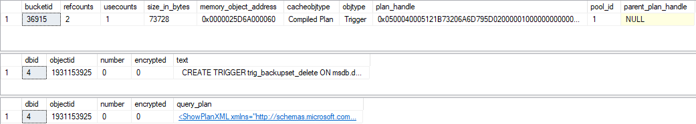
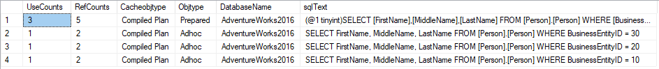
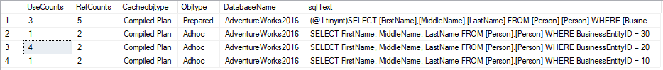
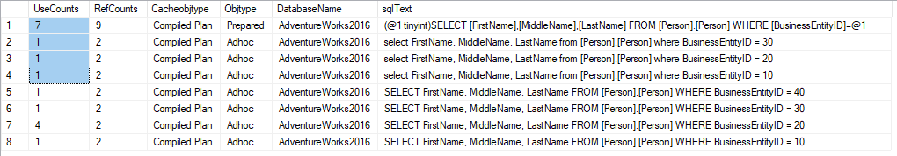

# Why query parametrization matters ?

<!-- Id: sql-why-query-parametrization-matters -->
<!-- Categories: SQL, Performance -->
<!-- Date: 20200403 -->

<!-- #header -->
Vulnerability for SQL injection is quite common knowledge about literal SQL. 
<!-- #endheader -->

I developed Data Access Layer application talking with Azure Sql Database. Having no much time I quickly use literal SQL statement instead of parametrized one. Quickly after deployment on stage environment I received message from Azure:


... also with some details and advices:

<table>
<tr>
<td>
Potential causes
</td>
<td>
Defect in application code constructing faulty SQL statements; application code doesn't sanitize user input and may be exploited to inject malicious SQL statements
</td>
</tr>

<tr>
<td>
Investigation steps
</td>
<td>
For details, view the alert in the Azure Security Center.
To investigate further, analyze your audit log. 
</td>
</tr>

<tr>
<td>
Remediation steps
</td>
<td>
Read more about SQL Injection threats, as well as best practices for writing safe application code. Please refer to Security Reference: SQL Injection.
</td>
</tr>
</table>

### That's all true but ...

What is interested is that there's no information about performance issues which literal SQL could cause.  

### Inside Query Plans

To take a look at query plan information we can use following features:

- sys.dm_exec_cached_plans 
- sys.dm_exec_sql_text  
- sys.dm_exec_query_plan 


```sql
-- sys.dm_exec_cached_plans is dynamic management view
SELECT top 1 * FROM sys.dm_exec_cached_plans

-- whereas sys.dm_exec_sql_text and sys.dm_exec_query_plan
DECLARE @plan_handle varbinary(max) = (SELECT TOP 1 plan_handle FROM sys.dm_exec_cached_plans)
SELECT * FROM sys.dm_exec_sql_text(@plan_handle) 
SELECT * FROM sys.dm_exec_query_plan(@plan_handle)
-- SELECT * FROM sys.dm_exec_plan_attributes(@plan_handle)
```



We can as well combine this items to have all in one.

```sql

SELECT UseCounts, RefCounts, Cacheobjtype, Objtype, ISNULL(DB_NAME(T.dbid),'ResourceDB') AS DatabaseName, TEXT AS sqlText, query_plan 
FROM sys.dm_exec_cached_plans 
CROSS APPLY sys.dm_exec_sql_text(plan_handle) T
CROSS APPLY sys.dm_exec_query_plan(plan_handle) P
WHERE T.dbid = DB_ID()
ORDER BY T.dbid,UseCounts DESC
```

https://docs.microsoft.com/en-us/sql/relational-databases/system-dynamic-management-views/sys-dm-exec-cached-plans-transact-sql?view=sql-server-ver15

Clearing cache should be performed by database admin and permissions for such operations should very careffully admited. Pu t

```sql
-- This command removes all cached plans from memory
DBCC FREEPROCCACHE

-- This command allows you to specify a particular database id, and then clears all plans from that particular database. 
DBCC FLUSHPROCINDB (<dbid>)
```

Statement below should be used between every excercise.

```sql
-- DBCC FLUSHPROCINDB (DB_ID('AdventureWorks2016')) doesn't work !
DECLARE @dbid smallint = (SELECT DB_ID('AdventureWorks2016'))
DBCC FLUSHPROCINDB (@dbid)
```

And here's little modified query to display only what we need.

```sql
SELECT UseCounts, RefCounts, Cacheobjtype, Objtype, ISNULL(DB_NAME(T.dbid),'ResourceDB') AS DatabaseName, TEXT AS sqlText
FROM sys.dm_exec_cached_plans 
CROSS APPLY sys.dm_exec_sql_text(plan_handle) T
WHERE T.dbid = DB_ID() and TEXT not like '%dm_exec_cached_plans%'
ORDER BY T.dbid, UseCounts DESC
```

### Statements 

Let's launch SQL queries below one by another.

```sql
-- (1) statement one by one
SELECT FirstName, MiddleName, LastName FROM [Person].[Person] WHERE BusinessEntityID = 10
SELECT FirstName, MiddleName, LastName FROM [Person].[Person] WHERE BusinessEntityID = 20
SELECT FirstName, MiddleName, LastName FROM [Person].[Person] WHERE BusinessEntityID = 30
```



```sql
-- execute this query x3
SELECT FirstName, MiddleName, LastName FROM [Person].[Person] WHERE BusinessEntityID = 20
```




```sql
SELECT FirstName, MiddleName, LastName FROM [Person].[Person] WHERE BusinessEntityID = 40
```


It seems like both *Prepared* and *Adhoc* plans were used. 

Last query is the same but i changed uppercased statements into lowercased.

```sql
select FirstName, MiddleName, LastName from [Person].[Person] where BusinessEntityID = 10
select FirstName, MiddleName, LastName from [Person].[Person] where BusinessEntityID = 20
select FirstName, MiddleName, LastName from [Person].[Person] where BusinessEntityID = 30
```



Optimizer is treating this queries as different queries but at least it takes advantage of *Prepared* query.


### Quering other way


```sql
-- (2) EXEC
EXEC('SELECT FirstName, MiddleName, LastName FROM [Person].[Person] WHERE BusinessEntityID = 10')
EXEC('SELECT FirstName, MiddleName, LastName FROM [Person].[Person] WHERE BusinessEntityID = 20')
EXEC('SELECT FirstName, MiddleName, LastName FROM [Person].[Person] WHERE BusinessEntityID = 30')
```

```sql
-- (3) sp_executesql (not parametrized)
EXEC sp_executesql N'SELECT FirstName, MiddleName, LastName FROM [Person].[Person] WHERE BusinessEntityID = 10'
EXEC sp_executesql N'SELECT FirstName, MiddleName, LastName FROM [Person].[Person] WHERE BusinessEntityID = 20'
EXEC sp_executesql N'SELECT FirstName, MiddleName, LastName FROM [Person].[Person] WHERE BusinessEntityID = 30'
```

### Parametrized queries

Now let's move to parametrized queries.

```sql
-- (4) sp_executesql with parameters
declare @parametrizedSql nvarchar(max) = 'SELECT FirstName, MiddleName, LastName FROM [Person].[Person] WHERE BusinessEntityID = @BusinessEntityID'
declare @parameterDefinition nvarchar(max) = '@BusinessEntityID int'
exec sp_executesql @parametrizedSql, @parameterDefinition, @BusinessEntityID=10
exec sp_executesql @parametrizedSql, @parameterDefinition, @BusinessEntityID=20
exec sp_executesql @parametrizedSql, @parameterDefinition, @BusinessEntityID=30
```
See that there's only one execution plan that was created for this query.


Let's make small change in query and in @parametrizedSql rename 'SELECT' to 'SELECt' 
```sql
declare @parametrizedSql nvarchar(max) = 'SELECt FirstName, MiddleName, LastName FROM [Person].[Person] WHERE BusinessEntityID = @BusinessEntityID'
```
and launch again queries one by another. Now, because of this tiny typo which shouldn't affect our query at all we have two execution plans:


SQL Server uses hash value as representation for every query. When query is run, SQL Server calculates hash and checks if there's such hash in cache. The hash value for the query plan is generated directly from the text. If there is even a tiny change in the query text a new hash value will be generated and there will be no match with existing hash values. 


