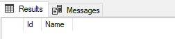

# Temporal Table feature overview

<!-- Id: sql-temporal-tables  -->
<!-- Categories: SQL, Step-By-Step -->
<!-- Date: 20180612  -->

<!-- #header -->
SQL Server 2016 introduced database feature that brings support for providing information about tracking the history of records processed with Create/Update/Delete operations. This is quite often business demand in enterprise applications. 
<!-- #endheader -->

So far it was realized in several ways:

- Creating Created, Updated columns in a table
- Creating a history table for dedicated base table and using triggers to update this table
- Creating history table for dedicated base table and using DAL application logic to update this table.

Temporal Tables (aka System version tables) are designed to meet this often business expectation.

The naming convention sometimes is confusing. I encountered using Temporal Table having attached historical table in mind. In fact, an existing ordinary table is converted to a Temporal Table with History Table attached.

There some prerequisites for ordinary table that

- Must have primary column
- Must have two periods (start and end date) datetime2 column

## Adding Temporal Table feature to ordinary table
Let’s consider a classic, ordinary table.

``` sql
-- (1) Normal Table
CREATE TABLE dbo.Employee
(
  Id   INT identity (1,1) primary key,
  Name VARCHAR(30)
);
GO
```

We need to track updates and deletions of records of this table.

First, we need to prepare our table to be converted to Temporal Table.

``` sql
-- (2) Alter to Temporal Table
ALTER TABLE dbo.Employee ADD
StartTime DATETIME2 GENERATED ALWAYS AS ROW START HIDDEN DEFAULT GETUTCDATE(),
EndTime  DATETIME2 GENERATED ALWAYS AS ROW END HIDDEN DEFAULT CONVERT(DATETIME2, '9999-12-31 23:59:59.9999999'),
PERIOD FOR SYSTEM_TIME (StartTime, EndTime);
GO
```

It’s a little bit annoying, that we need to add StartTime and EndTime to our table whereas our wish is to leave the basic table clean. At least we can add HIDDEN this fields and thought are displayed in designer:


… they are not visible in query results.




So far, our Employee is still ordinary table despite new fields. Now it is time for this table to become full-fledged Temporal Table.

``` sql
ALTER TABLE dbo.Employee
SET (SYSTEM_VERSIONING = ON (HISTORY_TABLE=dbo.EmployeeHistory))
GO
```

Result is visible in SSMS. Employee table is converted to System-Versioned and EmployeeHistory table is attached.


## Track changes in table

``` sql
-- (4) Play around with Temporals
insert into dbo.Employee values ('Anderson')
insert into dbo.Employee values ('Allen')
select * from dbo.Employee
select * from dbo.EmployeeHistory
``` 

So far History Table is clear.


Now we can rest assured that all our CRUD operations are logged.

## Querying to point in time

We can reproduce state of records in the past, in any moment from the past.

There is another advantage of Temporal Table feature. We can move back to past and reproduce query result from past – for example when we need to take look at personnel employed in the post.

It’s very easy operation and requires only to add FOR SYSTEM_TIME AS OF with date in statement.

``` sql
-- current state of table records
select * from dbo.Employee
-- table record in the past (modify date time literal)
select * from dbo.Employee FOR SYSTEM_TIME AS OF '2019-10-01T13:08:40'
```


## Removing system versioning

``` sql
ALTER TABLE dbo.Employee SET (SYSTEM_VERSIONING = OFF)
```


## Summary

Temporal tables are long-awaited future which surely relieve database and application developers from boring task of developing commonly demanded feature which is track changes in table records.


