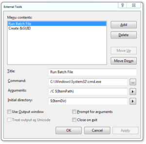
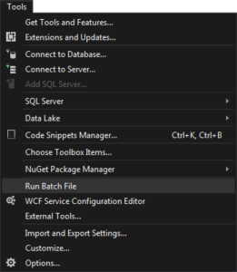

# Running batch file from Visual Studio

<!-- Id: vs-batch-file -->
<!-- Categories: Visual Studio  -->
<!-- Date: 20200321 -->

<!-- #header -->
TODO
<!-- #endheader -->

Select Tools -> External tools …

Create a tool with parameters as below:

Here’s code for you to copy:

Title: Run Batch File
Command:	C:\Windows\System32\cmd.exe
Arguments:	/C $(ItemPath)
Initial directory:	$(ItemDir)

Focus on a batch file you want to launch.

New item in Tools menu will be available.

