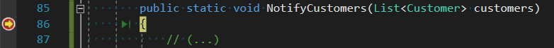
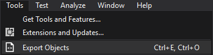
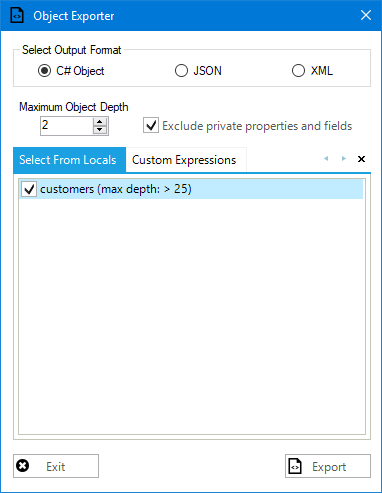
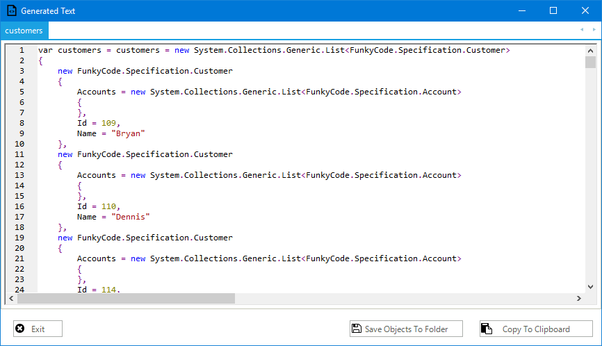
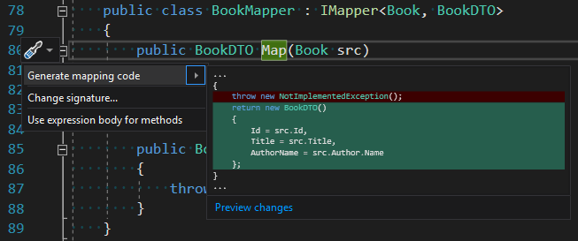

# Visual Studio Code Generating Extensions

<!-- Id: vs-code-gen-ext  -->
<!-- Categories: Visual Studio  -->
<!-- Date: 20181222  -->

<!-- #header -->
I am a big fan of code generation. I would like to have code typed instantly after it is designed in my head. It seems that there’s popular belief that what could be done in this subject was done in Resharper. To my regret, I haven’t found many solutions. But those which I found are great.
<!-- #endheader -->

1. Object Exporter

Object Exporter allows you to export whole object data to .NET code.

Under this link, there’s nice animation which illustrates the whole concept.

[Link](https://marketplace.visualstudio.com/items?itemName=OmarElabd.ObjectExporter)

It can be very useful when you need to have elaborated mock objects for unit tests, and you got these structures in the database,

or they are created via a user interface. In general, it works like this:

- Set breakpoint somewhere near your structure
- Run the app and stop at the previously set breakpoint



- Select tool in the menu



- Select the desired structure



- There is your object initialization code.



2. Mapping Generator

This one is useful for those who do not like AutoMapper. I meet a lot of people, who do not like this tool and practice manual mapping.

For me, it depends. When every mapping is hermetised in a separate class, you can use attitude suitable for every case.

[Link](https://marketplace.visualstudio.com/items?itemName=54748ff9-45fc-43c2-8ec5-cf7912bc3b84.mappinggenerator#overview)

Ok, we have some domain objects:

``` csharp
public class Book
{
    public int Id { get; set; }
    public string Title { get; set; }
    public int Year { get; set; }
    public decimal Price { get; set; }
    public string Genre { get; set; }
    public int AuthorId { get; set; }
    public Author Author { get; set; }
}
 
public class Author
{
    public int Id { get; set; }
    public string Name { get; set; }
}
```

… some DTO objects.

``` csharp
public class BookDTO
{
    public int Id { get; set; }
    public string Title { get; set; }
    public string AuthorName { get; set; }
}

public class BookDetailDTO
{
    public int Id { get; set; }
    public string Title { get; set; }
    public int Year { get; set; }
    public decimal Price { get; set; }
    public string AuthorName { get; set; }
    public string Genre { get; set; }
}
```

Now we need to map one into another.
I saw many mappings in controllers, repositories, but it makes code unreadable. So what about creating dedicated classes with the responsibility of mapping objects?

``` csharp
public interface IMapper<TSource, TDestination>
{
    TDestination Map(TSource src);
    TSource MapBack(TDestination dest);
}
```

So we have scaffoldings for these mappers. Let’s see what Mapping Generator can do for us.

``` csharp
public class BookMapper : IMapper<Book, BookDTO>
{
    public BookDTO Map(Book src)
    {
        throw new NotImplementedException();
    }

    public Book MapBack(BookDTO dest)
    {
        throw new NotImplementedException();
    }
}

public class BookDetailMapper : IMapper<Book, BookDetailDTO>
{
    public Book MapBack(BookDetailDTO dest)
    {
        throw new NotImplementedException();
    }

    BookDetailDTO IMapper<Book, BookDetailDTO>.Map(Book src)
    {
        throw new NotImplementedException();
    }
}
```

You need to put caret into the right place to see “Generate mapping code” command available.



What “the right place” means, it’s described under the link below.

[https://github.com/cezarypiatek/MappingGenerator](https://github.com/cezarypiatek/MappingGenerator)


