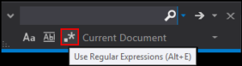

# Find and Replace with Regular Expressions

<!-- Id: vs-find-replace-regex  -->
<!-- Categories: Visual Studio  -->
<!-- Date: 20180125  -->

<!-- #header -->
Use Regular Expressions is rather not very popular feature in Find and Replace toolbox. For many years I was about to take look at this option, but always were too impatient to dig into this button and always do changes manually.
<!-- #endheader -->

But once I restricted myself from manually replacing content and took a look at this option.

Below I am presenting a couple of exemplary usages.

### Remove single line comments

|Field|Value|
|-----------|-------|
|Find	    |//.*\n |
|Replace    |	    |

### Swap elements in equation

|Field|Value|
|-
|Find	    |(.*) = (.*); 
|Replace    |$2 = $1;    

