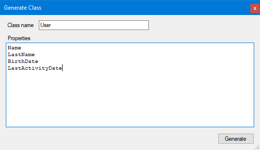
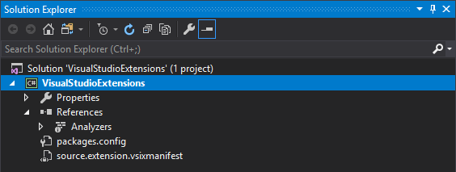
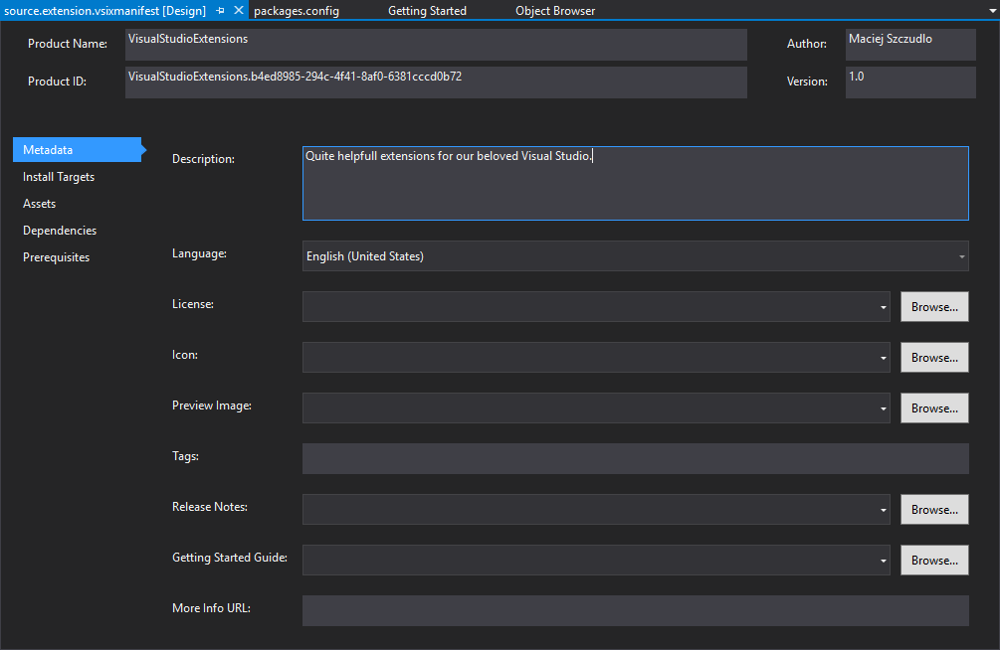
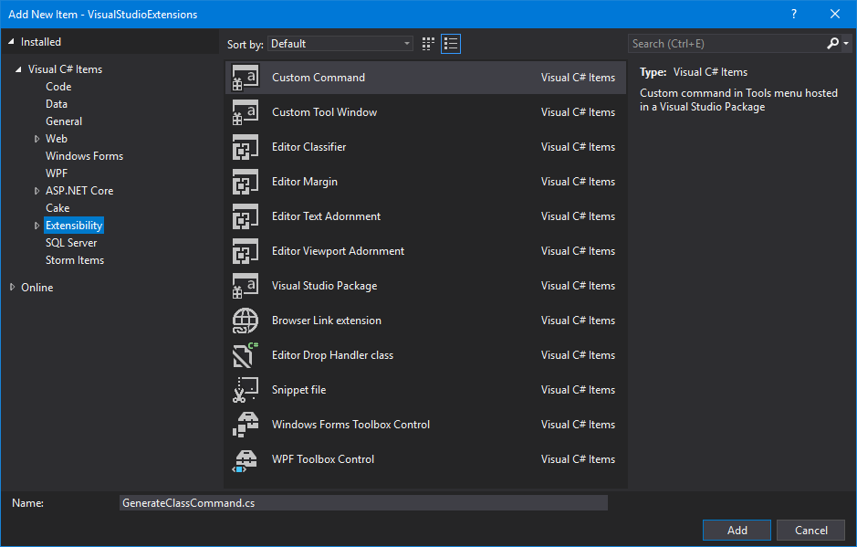
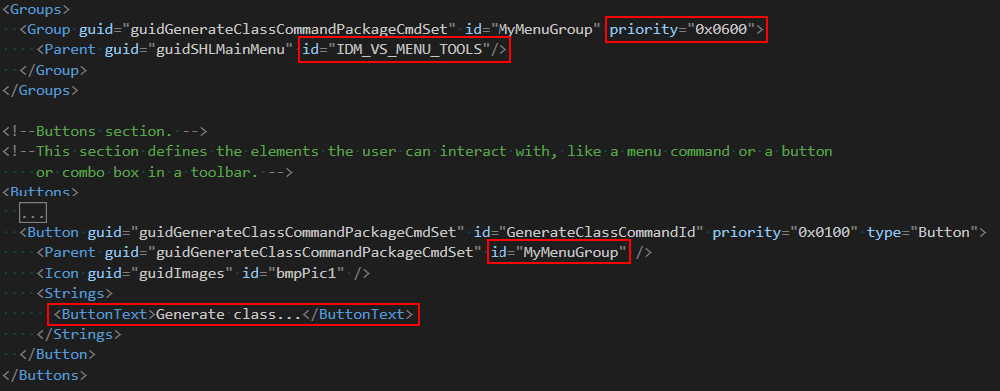
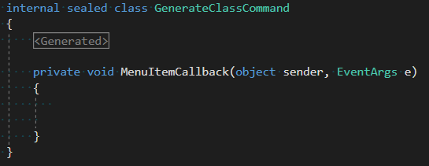
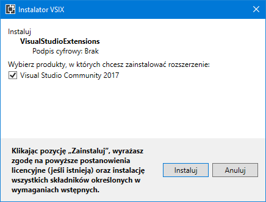
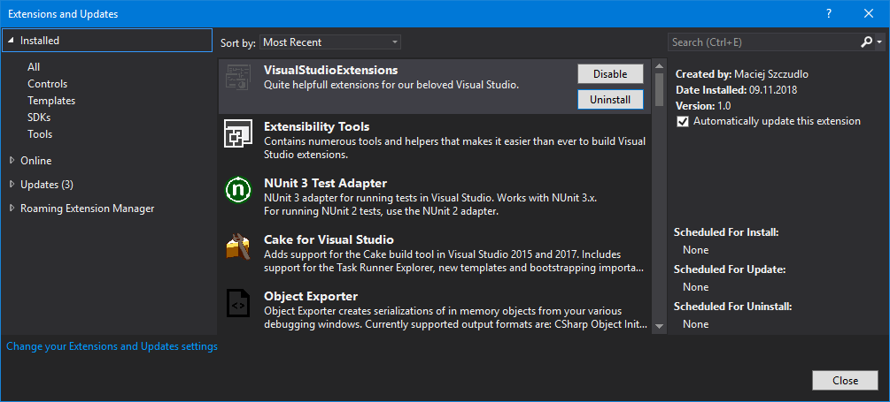

# Visual Studio Extension

<!-- Id: vs-custom-ext  -->
<!-- Categories: Visual Studio  -->
<!-- Date: 20180508  -->

<!-- #header -->
In the project I recently had been worked on I needed to create a lot of POCO classes. To make my work easier I quickly created simple Windows Forms application that helped me a little bit.
<!-- #endheader -->

I was bored with typing, even copy-pasting ‘public’, ‘get’, ‘set’ and other stuff, and written myself app that try to guess type out of name.

It works like this. I just type class name and property name:



Then app try to guess type out of name and generate class.

``` csharp
public class User
{
    public string Name {get; set;}
    public string LastName {get; set;}
    public DateTime BirthDate {get; set;}
    public DateTime LastActivityDate {get; set;}
}
```

Interface to this functionality is pretty simple.

``` csharp
interface IClassGeneratorEngine
{
        List<string> Generate(string className, List<string> propertyNames);
}
```

Prerequisites

- Visual Studio SDK


You can instantly remove index.html and stylesheet.css files because they are redundant. After that we see that project has no references and is almost empty except manifest file.





Click on source.extension.vsixmanifest file to open designer.
In future, it will help us to create a full-fledged package, but now let’s just fill Description field.

Things will get steam when we add New Item – Custom Command from Extensibility folder.



Configuration of our command is located in .vsct file. At this moment let’s concentrate on Groups and Buttons node.
Group is set of items between two line separators. Button is nothing more than menu item.



If you want to see group in context menu, change IDM_VS_MENU_TOOLS to IDM_VS_CTXT_CODEWIN which is a hook to the code window.

[Link](https://docs.microsoft.com/en-us/dotnet/api/microsoft.visualstudio.shell.vsmenus.idm_vs_ctxt_codewin?view=visualstudiosdk-2017)

GenerateClassCommand.cs is also automatically generated and contains a lot of code that needs to be rest in peace. We need to hook to MenuItemCallback handler. For my convenience, I wrapped all generated code into a region.



Here’s my code. Try it like inspiration, play with types which are exposed here. Most important thing is to obtain DTE2 object. Then we can extract data from Visual Studio.

``` csharp
IGenerateClassInputDataProvider _inputDataProvider = new GenerateClassInputDataProvider();
        IClassGeneratorEngine _classGeneratorEngine = new ClassGeneratorEngine(new PropertyTypeResolver());
 
        private void MenuItemCallback(object sender, EventArgs e)
        {
            ThreadHelper.ThrowIfNotOnUIThread();
 
            var dte = (DTE2)ServiceProvider.GetService(typeof(DTE));
            Assumes.Present(dte);
 
            var document = dte.ActiveDocument;
            var textDocument = document.Object() as TextDocument;
            var selection = textDocument.Selection;
            var selectionText = selection.Text;
 
            var inputData = _inputDataProvider.GetInputData(selectionText);
            var code = _classGeneratorEngine.Generate(inputData.ClassName, inputData.PropertyNames);
 
            var joined = Environment.NewLine + string.Join(Environment.NewLine, code);
 
            var editPoint = textDocument.CreateEditPoint(selection.BottomPoint);
            editPoint.Insert(joined);
        }
```

After that, just hit F5 and see what will happen. Visual Studio will run… Visual Studio in debug mode. Take look and header:


In Tools menu you should find our new command.


For now let’s learn how to install extension locally, just to use it on daily basis.

Go to .\bin\debug folder of our app. You should find .visx file.


Click this file to proceed instalation on your machine.



Go to Tools\Extensions and Updates, there you should find our extension installed.



